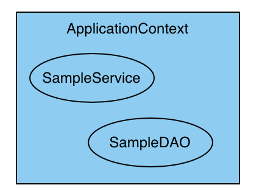
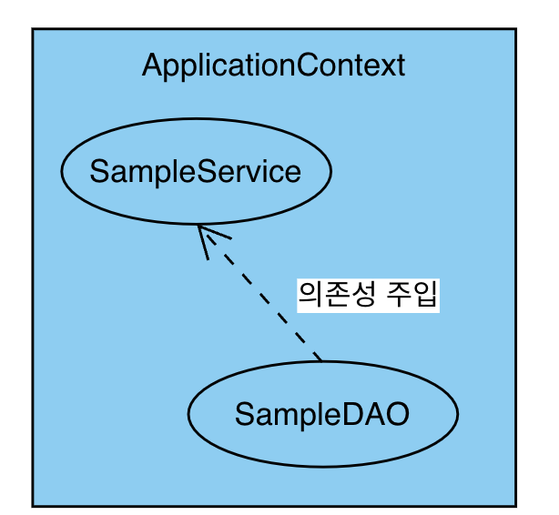

# 4.1 의존성 주입과 스프링

스프링 프레임워크가 가장 많이 사용되는 곳은 웹 개발 프로젝트지만, 스프링 프레임워크의 출발점은 객체지향이나 설계와
관련된 내용들이 주를 이루고 있다. 이번 절에서는 스프링을 이해하기 위한 핵심적인 내용으로 
`의존성 주입(dependency injection)`을 학습할 것이다.

## `스프링의 시작`

- 스프링 프레임워크는 원래 웹이라는 제한적인 용도로만 쓰이는 것이 아닌 객체지향의 `의존성 주입(dependency injection)`
기법을 적용할 수 있는 객체지향 프레임워크다.
- 로드 존슨이 2002년도에 집필했던 'J2EE 설계 및 개발(wrox)'이라는 책의 예제 코드에서 시작되었는데 말 그대로 효과적이고
가볍게 J2EE를 이용할 수 있다는 것을 증명하면서 예제의 코드들을 발전시킨 것이 스프링 프레임워크다.
- 2000년 당시 자바 진영에서 JavaEE의 여러 가지 스펙을 정의하고 비대해지는 동안 스프링 프레임워크는 
반대로 `light weight 프레임워크`를 목표로 만들어졌다.
- 그 당시 자바 진영에서는 EJB라는 기술을 기업용 애플리케이션 개발에 사용하기를 권장했지만 어마어마한 비용과 복잡함으로 인해
많은 비판이 있었다.
- 스프링 등장 시에 여러 종류의 프레임워크들이 비슷한 사상으로 등장했지만 다른 프레임워크들과 달리 스프링 프레임워크는 개발과
설계 전반에 관련된 문제들을 같이 다루었기 때문에 결론적으로 가장 성공한 프레임워크로 기록되었다.
- 스프링 프레임워크는 가장 중요한 '코어(core)' 역할을 하는 라이브러리와 여러 개의 추가적인 라이브러리를 결합하는 형태로
프로젝트를 구성한다.
- 가장 대표적으로 웹 MVC 구현을 쉽게 할 수 있는 `Spring Web MVC`나 JDBC를 쉽게 처리할 수 있는 
`MyBatis`를 연동하는 `mybatis-spring`과 같은 라이브러리가 그러한 예이다.


### 의존성 주입
- 스프링이 객체지향 구조를 설계할 때 받아들인 개념은 '의존성 주입'이며 '의존성 주입'은 어떻게 하면 '객체와 객체 간의
관계를 더 유연하게 유지할 것인가?'에 대한 고민으로 객체의 생성과 관계를 효과적으로 분리할 수 있는 방법에 대한 고민이다.
- 예를 들어 모든 컨트롤러들은 TodoService와 같은 서비스 객체를 이용해야만 하고 이 경우를 `컨트롤러는 서비스 객체에 의존적(dependent)`
라고 표현한다.
- 즉 `의존성이란` 하나의 객체가 자신이 해야 하는 일을 하기 위해서 다른 객체의 도움이 필수적인 관계를 의미한다.
- 과거에는 의존성을 해결하기 위해 컨트롤러에서 직접 서비스 객체를 생성하거나 앞의 예제들과 같이 하나의 객체만을 생성해 활용
하는 등의 다양한 패턴을 설계해서 적용해 왔지만 스프링 프레임워크는 바로 이런 점을 프레임워크 자체에서 지원하고 있다.
- 스프링 프레임워크는 다양한 방식으로 필요한 객체를 찾아서 사용할 수 있도록 XML 설정이나 자바 설정 등을 이용할 수 있으며
여기서는 XML설정을 이용하고, 뒤쪽의 스프링 부트편에서는 자바 설정을 이용할 것이다.


### 프로젝트 생성
- 'springex'라는 이름의 프로젝트를 생성한다.
- 프로젝트는 'Web application'으로 지정한다.
- Java와 Gradle을 이용하고 Group은 'org.zerock'을 지정한다.
- Java EE 8 버전 이용 설정을 한다.
- 프로젝트 생성 후 톰캣 관련 설정 조정
  - 상단 톰캣 부분에서 'Edig Configurations...' 클릭
  - [deployment] 설정 변경, 'war(exploaded)'로 지정하고 경로를 '/'로 조정
  - [Server] 탭에서는 On 'update' action와 On frame deactivation을 "Update classes and resources"로 변경


### 스프링 라이브러리 추가
- 프로젝트 생성 후에는 기본적으로 스프링을 구동하는 데 필요한 라이브러리들을 추가해줘야 한다.
- 스프링 프레임워크는 추가하는 jar파일에 따라 사용할 수 있는 기능들이 달라진다.
- 프레임워크 관련 라이브러리 버전은 구글을 이용해 [메이븐 저장소](https://mvnrepository.com/)에서 찾을 수 있다.
- build.gradle에 spring, Lombok, Log4j2, JSTL 라이브러리를 추가해보겠다.
  ```groovy
  dependencies {
    compileOnly('javax.servlet:javax.servlet-api:4.0.1')
  
    testImplementation("org.junit.jupiter:junit-jupiter-api:${junitVersion}")
    testRuntimeOnly("org.junit.jupiter:junit-jupiter-engine:${junitVersion}")
  
    //Spring
    implementation group: 'org.springframework', name: 'spring-core', version: '5.3.19'
    implementation group: 'org.springframework', name: 'spring-context', version: '5.3.19'
    implementation group: 'org.springframework', name: 'spring-test', version: '5.3.19'
  
    //Lombok
    compileOnly group: 'org.projectlombok', name: 'lombok', version: '1.18.24'
    annotationProcessor 'org.projectlombok:lombok:1.18.24'
    testCompileOnly 'org.projectlombok:lombok:1.18.24'
    testAnnotationProcessor 'org.projectlombok:lombok:1.18.24'
  
    //Log4j2
    implementation group: 'org.apache.logging.log4j', name: 'log4j-core', version: '2.17.2'
    implementation group: 'org.apache.logging.log4j', name: 'log4j-api', version: '2.17.2'
    implementation group: 'org.apache.logging.log4j', name: 'log4j-slf4j-impl', version: '2.17.2'
  
    //JSTL
    implementation group: 'jstl', name: 'jstl', version: '1.2'
  }
  ```


### 실습01 - 의존성 주입하기
- 개발 환경이 갖추어졌다면 스프링을 이용해 의존성 주입 실습을 해보자.
- 프로젝트에 sample라는 패키지를 작성하고 아무 내용 없는 SampleService와 SampleDAO 클래스를 추가한다.


#### 설정 파일 추가
- 스프링은 자체적으로 객체를 생성하고 관리하면서 필요한 곳으로 객체를 주입(inject)하는 역할을 하는데 이를 위해서는 설정
파일이나 어노테이션 등을 이용해야 한다.
- 스프링이 관리하는 객체들은 `빈(Bean)`이라는 이름으로 불리는데 프로젝트 내에서 어떤 빈(객체)들을 어떻게 관리할 것인지를 
설정하는 파일을 작성할 수 있다.
- 스프링의 빈 설정은 XML을 이용하거나 별도의 클래스를 이용하는 자바 설정이 가능하다.
- 여기서는 XML설정을 우선 이용하고 스프링 부트에서 자바 설정을 이용할 것이다.


> 다음은 설정 파일 추가 순서이다.

1. 'WEB-INF'에서 [New -> XML Configuration File -> Spring Config]를 선택한다.
2. 파일의 이름은 'root-context.xml'
3. 생성된 파일을 열면 오른쪽 상단에 [Configure application context]라는 설정 메뉴가 보이는데 이를 클릭 
(이는 현재 프로젝트를 인텔리제이에서 스프링 프레임워크로 인식하고 필요한 기능들을 지원하기 위한 설정이다.)
4. [Create new application context...] 항목을 선택하고 [root-context.xml]을 선택
5. 내부에 <bean>이라는 태그를 이용해서 SampleService와 SampleDAO를 다음과 같이 설정 (자동 완성 기능을 지원하기 때문에 쉽게 추가 가능)
  ```xml
  <?xml version="1.0" encoding="UTF-8"?>
  <beans xmlns="http://www.springframework.org/schema/beans"
         xmlns:xsi="http://www.w3.org/2001/XMLSchema-instance"
         xsi:schemaLocation="http://www.springframework.org/schema/beans http://www.springframework.org/schema/beans/spring-beans.xsd">
  
      <bean class="org.zerock.springex.sample.SampleDAO"></bean>
  
      <bean class="org.zerock.springex.sample.SampleService"></bean>
  
  </beans>
  ```

#### 스프링의 빈 설정 테스트
- 스프링으로 프로젝트를 구성하는 경우 상당히 많은 객체를 설정하므로 나중에 에러를 찾을 때 힘들다.
- 그래서 가능하면 개발 단계에서 많은 테스트를 진행해야 한다.
- test 폴더에 org.zerock.springex.sample패키지를 생성하고 SampleTests클래스를 추가하여 다음과 같이 작성한다.
  ```java
  @Log4j2
  @ExtendWith(SpringExtension.class)
  @ContextConfiguration(locations = "file:src/main/webapp/WEB-INF/root-context.xml")
  public class SampleTests {
  
    @Autowired
    private SampleService sampleService;
  
    @Test
    public void testService1(){
      log.info(sampleService);
      Assertions.assertNotNull(sampleService);
    }
  }
  ```
  - @Autowired는 스프링에서 사용하는 의존성 주입 관련 어노테이션으로 '만일 해당 타입의 빈(Bean)이 존재하면 여기에
  주입해 주기를 원한다'라는 의미이다.
  - @ExtendWith(SpringExtension.class)는 JUnit5 버전에서 'spring-test'를 이용하기 위한 설정이다.
    (JUnit4 버전에서는 @Runwith)
  - @ContextConfiguration 어노테이션은 스프링의 설정 정보를 로딩하기 위해 사용한다. 현재 프로젝트의 경우 XML로 설정되어
  있기 때문에 @ContextConfiguration의 locations 속성을 이용하고, 자바 설정을 이용하는 경우에는 classes 속성을 이용한다.
  - testService1()을 실행하면 다음과 같이 스프링에서 생성하고 관리하는 객체를 확인할 수 있다.
  ```
  01:09:25  INFO [org.springframework.test.context.support.DefaultTestContextBootstrapper] Loaded default TestExecutionListener class names from location [META-INF/spring.factories]: [org.springframework.test.context.web.ServletTestExecutionListener, org.springframework.test.context.support.DirtiesContextBeforeModesTestExecutionListener, org.springframework.test.context.event.ApplicationEventsTestExecutionListener, org.springframework.test.context.support.DependencyInjectionTestExecutionListener, org.springframework.test.context.support.DirtiesContextTestExecutionListener, org.springframework.test.context.transaction.TransactionalTestExecutionListener, org.springframework.test.context.jdbc.SqlScriptsTestExecutionListener, org.springframework.test.context.event.EventPublishingTestExecutionListener]
  01:09:25  INFO [org.springframework.test.context.support.DefaultTestContextBootstrapper] Using TestExecutionListeners: [org.springframework.test.context.support.DirtiesContextBeforeModesTestExecutionListener@54534abf, org.springframework.test.context.event.ApplicationEventsTestExecutionListener@51745f40, org.springframework.test.context.support.DependencyInjectionTestExecutionListener@45673f68, org.springframework.test.context.support.DirtiesContextTestExecutionListener@27abb83e, org.springframework.test.context.event.EventPublishingTestExecutionListener@69e308c6]
  01:09:25  INFO [org.zerock.springex.sample.SampleTests] org.zerock.springex.sample.SampleService@5ff60a8c
  ```
  - 만일 root-context.xml에 SampleService에 대한 설정이 없다면 NoSuchBeanDefinitionException(SampleService
  타입의 객체를 주입하려고 하지만 해당 타입의 객체가 스프링 내에 등록된 것이 없다는 메시지)가 출력된다.


## ApplicationContext와 빈(Bean)

- 테스트가 성공했다면 어떤 과정을 통해 이런 결과가 발생했는지를 알아야 한다.
- 이때 필요한 용어가 ApplicationContext
- 웹을 공부할 떄 서블릿이 존재하는 공간을 Servlet Context라고 했던 것 처럼 `스프링에서는 Bean이라고 부르는
객체들을 관리하기 위해서 ApplicationContext라는 존재를 활용한다.`
- 예제의 경우 ApplicationContext는 root-context.xml을 이용해서 스프링이 실행되고 ApplicationContext
객체가 생성된다.
- 이때 root-context.xml을 읽으면서 SampleService와 SampleDAO와 같은 'bean'으로 지정되어 있는 클래스의
객체를 생성해 관리하기 시작한다.

  


### @Autowired의 의미와 필드 주입
- 아까 테스트 코드에서 @Autowired로 처리된 부분에서 의존성 주입이 일어난다.
- 테스트를 실행하면 미리 생성되었던 ApplicationContext에 있는 SampleService라는 Bean이 테스트 코드 실행 시에
주입된다.
- 이렇게 멤버 변수에 직접 @Autowired를 선언하는 방식을 `필드 주입(Field Injection)`방식이라고 한다.

### 실습02 - SampleDAO 주입하기
- @Autowired를 이용해 필요한 타입을 주입받을 수 있다는 사실을 이용해 SampleService를 다음과 같이 변경해보자.
  ```java
  @ToString
  public class SampleService {
    @Autowired
    private SampleDAO sampleDAO;
  }
  ```
  - Test 코드에서 log.info로 출력하기 때문에 Lombok의 @ToString을 적용했다.
  - SampleDAO를 @Autowired를 통해 주입하였다.
- 테스트 코드가 실행되는 환경은 다음과 같은 구조가 된다.

  

- 또한 실행해보면 SampleService 객체 안에 SampleDAO 객체가 주입된 것을 확인할 수 있다.
  ```
  09:28:17  INFO [org.springframework.test.context.support.DefaultTestContextBootstrapper] Loaded default TestExecutionListener class names from location [META-INF/spring.factories]: [org.springframework.test.context.web.ServletTestExecutionListener, org.springframework.test.context.support.DirtiesContextBeforeModesTestExecutionListener, org.springframework.test.context.event.ApplicationEventsTestExecutionListener, org.springframework.test.context.support.DependencyInjectionTestExecutionListener, org.springframework.test.context.support.DirtiesContextTestExecutionListener, org.springframework.test.context.transaction.TransactionalTestExecutionListener, org.springframework.test.context.jdbc.SqlScriptsTestExecutionListener, org.springframework.test.context.event.EventPublishingTestExecutionListener]
  09:28:17  INFO [org.springframework.test.context.support.DefaultTestContextBootstrapper] Using TestExecutionListeners: [org.springframework.test.context.support.DirtiesContextBeforeModesTestExecutionListener@54534abf, org.springframework.test.context.event.ApplicationEventsTestExecutionListener@51745f40, org.springframework.test.context.support.DependencyInjectionTestExecutionListener@45673f68, org.springframework.test.context.support.DirtiesContextTestExecutionListener@27abb83e, org.springframework.test.context.event.EventPublishingTestExecutionListener@69e308c6]
  09:28:17  INFO [org.zerock.springex.sample.SampleTests] SampleService(sampleDAO=org.zerock.springex.sample.SampleDAO@7ce4de34)
  ```

### context:component-scan
- 스프링을 이용할 때는 클래스를 작성하거나 객체를 직접 생성하지 않는다.
- 이 역할은 스프링 내부에서 이루어지며 ApplicationContext가 생성된 객체들을 관리하게 된다.
- 이처럼 개발자가 직접 객체를 생성하지 않는 방식은 마치 서블릿과도 상당히 유사하며 서블릿을 생성하면 톰캣이 웹 애플리
케이션을 실행하고 필요할 때 서블릿 객체를 만드는 것과 비슷한 방식이다.
- 과거에는 서블릿 기술도 web.xml에 \<servlet>이라는 태그를 이용해 서블릿 클래스의 이름과 경로를 전부 기록해야만
했지만, 최근에는 @WebServlet 어노테이션이 이를 대신하고 있다.
- 스프링도 비슷한 방식으로 발전해왔으며 초기 스프링 버전에서는 XML 파일에 \<bean>이라는 것을 이용해 설정하는 방식이 
2.5버전 이후에 어노테이션 형태로 변화되면서 예전에 비해 편리하게 설정이 가능해졌다.


### 실습03 - @Service, @Repository
- 서블릿에서도 @WebServlet이나 @WebFilter와 같이 다양한 어노테이션이 존재하듯이 스프링 프레임워크는 애플리케이션
전체를 커버하기 때문에 다양한 종류의 어노테이션을 사용하도록 되었다.(스프링 2.5버전 이후).
  - @Controller: MVC의 컨트롤러를 위한 어노테이션
  - @Service: 서비스 계층의 객체를 위한 어노테이션
  - @Repository: DAO와 같은 객체를 위한 어노테이션
  - @Component: 일반 객체나 유틸리티 객체를 위한 어노테이션
- 어노테이션 이름으로 알 수 있듯이 스프링이 사용하는 어노테이션의 경우 웹 영역뿐만 아니라 APP 전체에 사용할 수 있는
객체들을 망라하고 있다.
- 어노테이션을 이용하게 되면 스프링 설정은 `해당 패키지를 조사해 클래스의 어노테이션들을 이용`하는 설정으로 변경된다.
- root-context.xml의 설정은 다음과 같이 변경한다.
  ```xml
  <?xml version="1.0" encoding="UTF-8"?>
  <beans xmlns="http://www.springframework.org/schema/beans"
         xmlns:xsi="http://www.w3.org/2001/XMLSchema-instance"
         xmlns:context="http://www.springframework.org/schema/context"
         xsi:schemaLocation="http://www.springframework.org/schema/beans
         http://www.springframework.org/schema/beans/spring-beans.xsd
         http://www.springframework.org/schema/context
         https://www.springframework.org/schema/context/spring-context.xsd">
  
      <context:component-scan base-package="org.zerock.springex.sample"/>
  
  </beans>
  ```
  - 기존 설정과 비교하여 XML위쪽의 xmlns(네임 스페이스)가 추가되었다.
  - schemaLocation이 변경되었다. (인텔리제이는 해당 작업이 자동으로 처리 됨)
  - 내용에는 'component-scan'이 추가되었는데 속성 값으로는 패키지를 지정하며 해당 패키지를 스캔하여 스프링의
  어노테이션들을 인식한다.
- SampleDAO에서는 해당 클래스의 객체가 스프링에서 Bean으로 관리될 수 있도록 @Repository라는 어노테이션을 추가하며 
SampleService에서는 @Service어노테이션을 추가한다.
  ```java
  @Repository
  public class SampleDAO {
  }
  ```
  ```java
  @Service
  @ToString
  public class SampleService {
    @Autowired
    private SampleDAO sampleDAO;
  }
  ```
- 이후 실행해보면 정상적으로 작동하는 것을 볼 수 있다.
  ```
  09:45:05  INFO [org.springframework.test.context.support.DefaultTestContextBootstrapper] Loaded default TestExecutionListener class names from location [META-INF/spring.factories]: [org.springframework.test.context.web.ServletTestExecutionListener, org.springframework.test.context.support.DirtiesContextBeforeModesTestExecutionListener, org.springframework.test.context.event.ApplicationEventsTestExecutionListener, org.springframework.test.context.support.DependencyInjectionTestExecutionListener, org.springframework.test.context.support.DirtiesContextTestExecutionListener, org.springframework.test.context.transaction.TransactionalTestExecutionListener, org.springframework.test.context.jdbc.SqlScriptsTestExecutionListener, org.springframework.test.context.event.EventPublishingTestExecutionListener]
  09:45:05  INFO [org.springframework.test.context.support.DefaultTestContextBootstrapper] Using TestExecutionListeners: [org.springframework.test.context.support.DirtiesContextBeforeModesTestExecutionListener@54534abf, org.springframework.test.context.event.ApplicationEventsTestExecutionListener@51745f40, org.springframework.test.context.support.DependencyInjectionTestExecutionListener@45673f68, org.springframework.test.context.support.DirtiesContextTestExecutionListener@27abb83e, org.springframework.test.context.event.EventPublishingTestExecutionListener@69e308c6]
  09:45:05  INFO [org.zerock.springex.sample.SampleTests] SampleService(sampleDAO=org.zerock.springex.sample.SampleDAO@bd1111a)
  ```

### 생성자 주입 방식
- 초기 스프링에서는 @Autowired를 멤버 변수에 할당하거나, Setter를 작성하는 방식을 많이 이용했지만, 스프링 3 이후에는
생성자 주입 방식이라고 부르는 방식을 더 많이 활용하고 있다.
- 생성자 주입 방식은 다음과 같은 규칙으로 작성된다.
  - 주입 받아야 하는 객체의 변수는 final로 작성
  - 생성자를 이용해서 해당 변수를 생성자의 파라미터로 지정
- 생성자 주입 방식은 객체를 생성할 때 문제가 발생하는지를 미리 확인할 수 있기 때문에 필드 주입이나 Setter주입 방식보다
선호된다.
- Lombok에서는 생성자 주입을 보다 간단히 작성할 수 있는데 @RequiredArgsConstructor를 이용해 필요한 생성자 함수를
자동으로 작성할 수 있기 때문이다.
- SampleService를 다음과 같이 수정할 수 있다.
  ```java
  @Service
  @ToString
  @RequiredArgsConstructor
  public class SampleService {
    private final SampleDAO sampleDAO;
  }
  ```

> Lombok의 @RequiredArgsConstructor 어노테이션은 클래스 내의 모든 'final' 필드 또는 '@NonNull'
> 어노테이션이 붙은 필드를 매개변수로 갖는 생성자를 자동으로 생성해준다. 이렇게 자동 생성된 생성자를 통해 스프링 프레임
> 워크는 런타임 시 필요한 의존성을 해당 클래스의 인스턴스에 주입할 수 있다.


