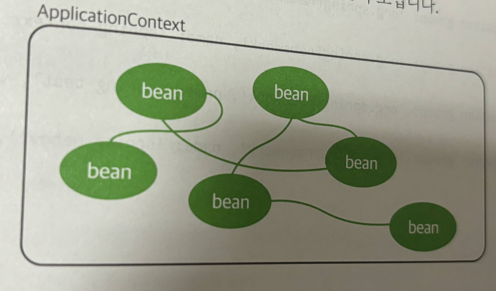
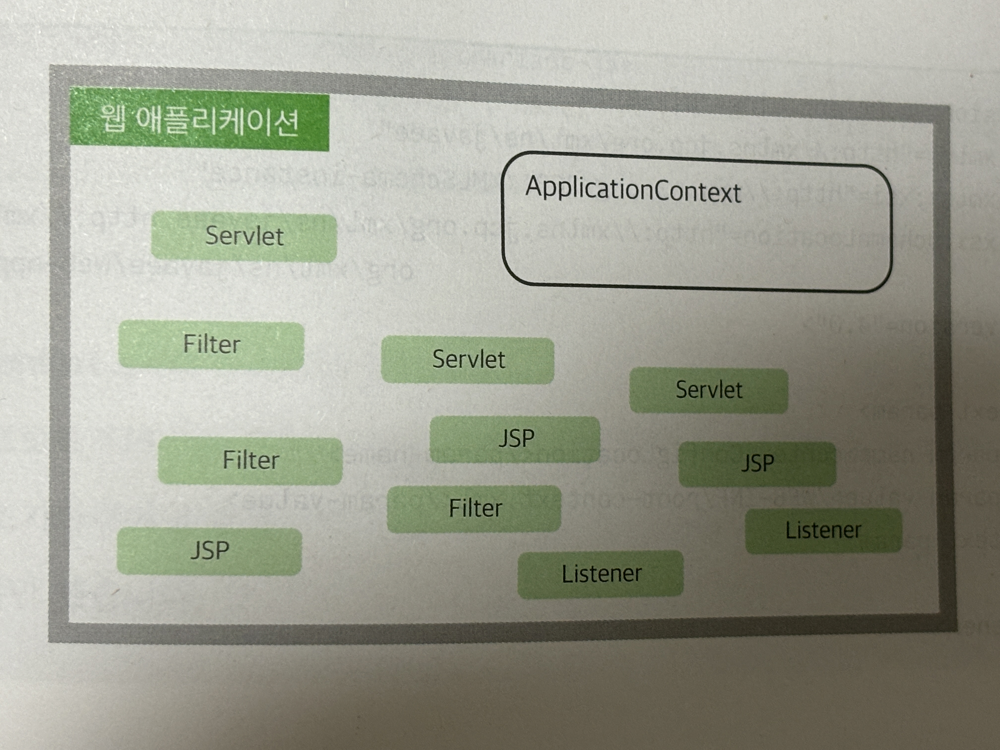

# 4.1 의존성 주입과 스프링

스프링 프레임워크가 가장 많이 사용되는 곳은 웹 개발 프로젝트지만, 스프링 프레임워크의 출발점은 객체지향이나 설계와
관련된 내용들이 주를 이루고 있다. 이번 절에서는 스프링을 이해하기 위한 핵심적인 내용으로 
`의존성 주입(dependency injection)`을 학습할 것이다.

## `스프링의 시작`

- 스프링 프레임워크는 원래 웹이라는 제한적인 용도로만 쓰이는 것이 아닌 객체지향의 `의존성 주입(dependency injection)`
기법을 적용할 수 있는 객체지향 프레임워크다.
- 로드 존슨이 2002년도에 집필했던 'J2EE 설계 및 개발(wrox)'이라는 책의 예제 코드에서 시작되었는데 말 그대로 효과적이고
가볍게 J2EE를 이용할 수 있다는 것을 증명하면서 예제의 코드들을 발전시킨 것이 스프링 프레임워크다.
- 2000년 당시 자바 진영에서 JavaEE의 여러 가지 스펙을 정의하고 비대해지는 동안 스프링 프레임워크는 
반대로 `light weight 프레임워크`를 목표로 만들어졌다.
- 그 당시 자바 진영에서는 EJB라는 기술을 기업용 애플리케이션 개발에 사용하기를 권장했지만 어마어마한 비용과 복잡함으로 인해
많은 비판이 있었다.
- 스프링 등장 시에 여러 종류의 프레임워크들이 비슷한 사상으로 등장했지만 다른 프레임워크들과 달리 스프링 프레임워크는 개발과
설계 전반에 관련된 문제들을 같이 다루었기 때문에 결론적으로 가장 성공한 프레임워크로 기록되었다.
- 스프링 프레임워크는 가장 중요한 '코어(core)' 역할을 하는 라이브러리와 여러 개의 추가적인 라이브러리를 결합하는 형태로
프로젝트를 구성한다.
- 가장 대표적으로 웹 MVC 구현을 쉽게 할 수 있는 `Spring Web MVC`나 JDBC를 쉽게 처리할 수 있는 
`MyBatis`를 연동하는 `mybatis-spring`과 같은 라이브러리가 그러한 예이다.


### 의존성 주입
- 스프링이 객체지향 구조를 설계할 때 받아들인 개념은 '의존성 주입'이며 '의존성 주입'은 어떻게 하면 '객체와 객체 간의
관계를 더 유연하게 유지할 것인가?'에 대한 고민으로 객체의 생성과 관계를 효과적으로 분리할 수 있는 방법에 대한 고민이다.
- 예를 들어 모든 컨트롤러들은 TodoService와 같은 서비스 객체를 이용해야만 하고 이 경우를 `컨트롤러는 서비스 객체에 의존적(dependent)`
라고 표현한다.
- 즉 `의존성이란` 하나의 객체가 자신이 해야 하는 일을 하기 위해서 다른 객체의 도움이 필수적인 관계를 의미한다.
- 과거에는 의존성을 해결하기 위해 컨트롤러에서 직접 서비스 객체를 생성하거나 앞의 예제들과 같이 하나의 객체만을 생성해 활용
하는 등의 다양한 패턴을 설계해서 적용해 왔지만 스프링 프레임워크는 바로 이런 점을 프레임워크 자체에서 지원하고 있다.
- 스프링 프레임워크는 다양한 방식으로 필요한 객체를 찾아서 사용할 수 있도록 XML 설정이나 자바 설정 등을 이용할 수 있으며
여기서는 XML설정을 이용하고, 뒤쪽의 스프링 부트편에서는 자바 설정을 이용할 것이다.


### 프로젝트 생성
- 'springex'라는 이름의 프로젝트를 생성한다.
- 프로젝트는 'Web application'으로 지정한다.
- Java와 Gradle을 이용하고 Group은 'org.zerock'을 지정한다.
- Java EE 8 버전 이용 설정을 한다.
- 프로젝트 생성 후 톰캣 관련 설정 조정
  - 상단 톰캣 부분에서 'Edig Configurations...' 클릭
  - [deployment] 설정 변경, 'war(exploaded)'로 지정하고 경로를 '/'로 조정
  - [Server] 탭에서는 On 'update' action와 On frame deactivation을 "Update classes and resources"로 변경


### 스프링 라이브러리 추가
- 프로젝트 생성 후에는 기본적으로 스프링을 구동하는 데 필요한 라이브러리들을 추가해줘야 한다.
- 스프링 프레임워크는 추가하는 jar파일에 따라 사용할 수 있는 기능들이 달라진다.
- 프레임워크 관련 라이브러리 버전은 구글을 이용해 [메이븐 저장소](https://mvnrepository.com/)에서 찾을 수 있다.
- build.gradle에 spring, Lombok, Log4j2, JSTL 라이브러리를 추가해보겠다.
  ```groovy
  dependencies {
    compileOnly('javax.servlet:javax.servlet-api:4.0.1')
  
    testImplementation("org.junit.jupiter:junit-jupiter-api:${junitVersion}")
    testRuntimeOnly("org.junit.jupiter:junit-jupiter-engine:${junitVersion}")
  
    //Spring
    implementation group: 'org.springframework', name: 'spring-core', version: '5.3.19'
    implementation group: 'org.springframework', name: 'spring-context', version: '5.3.19'
    implementation group: 'org.springframework', name: 'spring-test', version: '5.3.19'
  
    //Lombok
    compileOnly group: 'org.projectlombok', name: 'lombok', version: '1.18.24'
    annotationProcessor 'org.projectlombok:lombok:1.18.24'
    testCompileOnly 'org.projectlombok:lombok:1.18.24'
    testAnnotationProcessor 'org.projectlombok:lombok:1.18.24'
  
    //Log4j2
    implementation group: 'org.apache.logging.log4j', name: 'log4j-core', version: '2.17.2'
    implementation group: 'org.apache.logging.log4j', name: 'log4j-api', version: '2.17.2'
    implementation group: 'org.apache.logging.log4j', name: 'log4j-slf4j-impl', version: '2.17.2'
  
    //JSTL
    implementation group: 'jstl', name: 'jstl', version: '1.2'
  }
  ```


### 실습01 - 의존성 주입하기
- 개발 환경이 갖추어졌다면 스프링을 이용해 의존성 주입 실습을 해보자.
- 프로젝트에 sample라는 패키지를 작성하고 아무 내용 없는 SampleService와 SampleDAO 클래스를 추가한다.


#### 설정 파일 추가
- 스프링은 자체적으로 객체를 생성하고 관리하면서 필요한 곳으로 객체를 주입(inject)하는 역할을 하는데 이를 위해서는 설정
파일이나 어노테이션 등을 이용해야 한다.
- 스프링이 관리하는 객체들은 `빈(Bean)`이라는 이름으로 불리는데 프로젝트 내에서 어떤 빈(객체)들을 어떻게 관리할 것인지를 
설정하는 파일을 작성할 수 있다.
- 스프링의 빈 설정은 XML을 이용하거나 별도의 클래스를 이용하는 자바 설정이 가능하다.
- 여기서는 XML설정을 우선 이용하고 스프링 부트에서 자바 설정을 이용할 것이다.


> 다음은 설정 파일 추가 순서이다.

1. 'WEB-INF'에서 [New -> XML Configuration File -> Spring Config]를 선택한다.
2. 파일의 이름은 'root-context.xml'
3. 생성된 파일을 열면 오른쪽 상단에 [Configure application context]라는 설정 메뉴가 보이는데 이를 클릭 
(이는 현재 프로젝트를 인텔리제이에서 스프링 프레임워크로 인식하고 필요한 기능들을 지원하기 위한 설정이다.)
4. [Create new application context...] 항목을 선택하고 [root-context.xml]을 선택
5. 내부에 \<bean>이라는 태그를 이용해서 SampleService와 SampleDAO를 다음과 같이 설정 (자동 완성 기능을 지원하기 때문에 쉽게 추가 가능)
  ```xml
  <?xml version="1.0" encoding="UTF-8"?>
  <beans xmlns="http://www.springframework.org/schema/beans"
         xmlns:xsi="http://www.w3.org/2001/XMLSchema-instance"
         xsi:schemaLocation="http://www.springframework.org/schema/beans http://www.springframework.org/schema/beans/spring-beans.xsd">
  
      <bean class="org.zerock.springex.sample.SampleDAO"></bean>
  
      <bean class="org.zerock.springex.sample.SampleService"></bean>
  
  </beans>
  ```

#### 스프링의 빈 설정 테스트
- 스프링으로 프로젝트를 구성하는 경우 상당히 많은 객체를 설정하므로 나중에 에러를 찾을 때 힘들다.
- 그래서 가능하면 개발 단계에서 많은 테스트를 진행해야 한다.
- test 폴더에 org.zerock.springex.sample패키지를 생성하고 SampleTests클래스를 추가하여 다음과 같이 작성한다.
  ```java
  @Log4j2
  @ExtendWith(SpringExtension.class)
  @ContextConfiguration(locations = "file:src/main/webapp/WEB-INF/root-context.xml")
  public class SampleTests {
  
    @Autowired
    private SampleService sampleService;
  
    @Test
    public void testService1(){
      log.info(sampleService);
      Assertions.assertNotNull(sampleService);
    }
  }
  ```
  - @Autowired는 스프링에서 사용하는 의존성 주입 관련 어노테이션으로 '만일 해당 타입의 빈(Bean)이 존재하면 여기에
  주입해 주기를 원한다'라는 의미이다.
  - @ExtendWith(SpringExtension.class)는 JUnit5 버전에서 'spring-test'를 이용하기 위한 설정이다.
    (JUnit4 버전에서는 @Runwith)
  - @ContextConfiguration 어노테이션은 스프링의 설정 정보를 로딩하기 위해 사용한다. 현재 프로젝트의 경우 XML로 설정되어
  있기 때문에 @ContextConfiguration의 locations 속성을 이용하고, 자바 설정을 이용하는 경우에는 classes 속성을 이용한다.
  - testService1()을 실행하면 다음과 같이 스프링에서 생성하고 관리하는 객체를 확인할 수 있다.
  ```
  01:09:25  INFO [org.springframework.test.context.support.DefaultTestContextBootstrapper] Loaded default TestExecutionListener class names from location [META-INF/spring.factories]: [org.springframework.test.context.web.ServletTestExecutionListener, org.springframework.test.context.support.DirtiesContextBeforeModesTestExecutionListener, org.springframework.test.context.event.ApplicationEventsTestExecutionListener, org.springframework.test.context.support.DependencyInjectionTestExecutionListener, org.springframework.test.context.support.DirtiesContextTestExecutionListener, org.springframework.test.context.transaction.TransactionalTestExecutionListener, org.springframework.test.context.jdbc.SqlScriptsTestExecutionListener, org.springframework.test.context.event.EventPublishingTestExecutionListener]
  01:09:25  INFO [org.springframework.test.context.support.DefaultTestContextBootstrapper] Using TestExecutionListeners: [org.springframework.test.context.support.DirtiesContextBeforeModesTestExecutionListener@54534abf, org.springframework.test.context.event.ApplicationEventsTestExecutionListener@51745f40, org.springframework.test.context.support.DependencyInjectionTestExecutionListener@45673f68, org.springframework.test.context.support.DirtiesContextTestExecutionListener@27abb83e, org.springframework.test.context.event.EventPublishingTestExecutionListener@69e308c6]
  01:09:25  INFO [org.zerock.springex.sample.SampleTests] org.zerock.springex.sample.SampleService@5ff60a8c
  ```
  - 만일 root-context.xml에 SampleService에 대한 설정이 없다면 NoSuchBeanDefinitionException(SampleService
  타입의 객체를 주입하려고 하지만 해당 타입의 객체가 스프링 내에 등록된 것이 없다는 메시지)가 출력된다.


## ApplicationContext와 빈(Bean)

- 테스트가 성공했다면 어떤 과정을 통해 이런 결과가 발생했는지를 알아야 한다.
- 이때 필요한 용어가 ApplicationContext
- 웹을 공부할 떄 서블릿이 존재하는 공간을 Servlet Context라고 했던 것 처럼 `스프링에서는 Bean이라고 부르는
객체들을 관리하기 위해서 ApplicationContext라는 존재를 활용한다.`
- 예제의 경우 ApplicationContext는 root-context.xml을 이용해서 스프링이 실행되고 ApplicationContext
객체가 생성된다.
- 이때 root-context.xml을 읽으면서 SampleService와 SampleDAO와 같은 'bean'으로 지정되어 있는 클래스의
객체를 생성해 관리하기 시작한다.

  


### @Autowired의 의미와 필드 주입
- 아까 테스트 코드에서 @Autowired로 처리된 부분에서 의존성 주입이 일어난다.
- 테스트를 실행하면 미리 생성되었던 ApplicationContext에 있는 SampleService라는 Bean이 테스트 코드 실행 시에
주입된다.
- 이렇게 멤버 변수에 직접 @Autowired를 선언하는 방식을 `필드 주입(Field Injection)`방식이라고 한다.

### 실습02 - SampleDAO 주입하기
- @Autowired를 이용해 필요한 타입을 주입받을 수 있다는 사실을 이용해 SampleService를 다음과 같이 변경해보자.
  ```java
  @ToString
  public class SampleService {
    @Autowired
    private SampleDAO sampleDAO;
  }
  ```
  - Test 코드에서 log.info로 출력하기 때문에 Lombok의 @ToString을 적용했다.
  - SampleDAO를 @Autowired를 통해 주입하였다.
- 테스트 코드가 실행되는 환경은 다음과 같은 구조가 된다.

  

- 또한 실행해보면 SampleService 객체 안에 SampleDAO 객체가 주입된 것을 확인할 수 있다.
  ```
  09:28:17  INFO [org.springframework.test.context.support.DefaultTestContextBootstrapper] Loaded default TestExecutionListener class names from location [META-INF/spring.factories]: [org.springframework.test.context.web.ServletTestExecutionListener, org.springframework.test.context.support.DirtiesContextBeforeModesTestExecutionListener, org.springframework.test.context.event.ApplicationEventsTestExecutionListener, org.springframework.test.context.support.DependencyInjectionTestExecutionListener, org.springframework.test.context.support.DirtiesContextTestExecutionListener, org.springframework.test.context.transaction.TransactionalTestExecutionListener, org.springframework.test.context.jdbc.SqlScriptsTestExecutionListener, org.springframework.test.context.event.EventPublishingTestExecutionListener]
  09:28:17  INFO [org.springframework.test.context.support.DefaultTestContextBootstrapper] Using TestExecutionListeners: [org.springframework.test.context.support.DirtiesContextBeforeModesTestExecutionListener@54534abf, org.springframework.test.context.event.ApplicationEventsTestExecutionListener@51745f40, org.springframework.test.context.support.DependencyInjectionTestExecutionListener@45673f68, org.springframework.test.context.support.DirtiesContextTestExecutionListener@27abb83e, org.springframework.test.context.event.EventPublishingTestExecutionListener@69e308c6]
  09:28:17  INFO [org.zerock.springex.sample.SampleTests] SampleService(sampleDAO=org.zerock.springex.sample.SampleDAO@7ce4de34)
  ```

### context:component-scan
- 스프링을 이용할 때는 클래스를 작성하거나 객체를 직접 생성하지 않는다.
- 이 역할은 스프링 내부에서 이루어지며 ApplicationContext가 생성된 객체들을 관리하게 된다.
- 이처럼 개발자가 직접 객체를 생성하지 않는 방식은 마치 서블릿과도 상당히 유사하며 서블릿을 생성하면 톰캣이 웹 애플리
케이션을 실행하고 필요할 때 서블릿 객체를 만드는 것과 비슷한 방식이다.
- 과거에는 서블릿 기술도 web.xml에 \<servlet>이라는 태그를 이용해 서블릿 클래스의 이름과 경로를 전부 기록해야만
했지만, 최근에는 @WebServlet 어노테이션이 이를 대신하고 있다.
- 스프링도 비슷한 방식으로 발전해왔으며 초기 스프링 버전에서는 XML 파일에 \<bean>이라는 것을 이용해 설정하는 방식이 
2.5버전 이후에 어노테이션 형태로 변화되면서 예전에 비해 편리하게 설정이 가능해졌다.


### 실습03 - @Service, @Repository
- 서블릿에서도 @WebServlet이나 @WebFilter와 같이 다양한 어노테이션이 존재하듯이 스프링 프레임워크는 애플리케이션
전체를 커버하기 때문에 다양한 종류의 어노테이션을 사용하도록 되었다.(스프링 2.5버전 이후).
  - @Controller: MVC의 컨트롤러를 위한 어노테이션
  - @Service: 서비스 계층의 객체를 위한 어노테이션
  - @Repository: DAO와 같은 객체를 위한 어노테이션
  - @Component: 일반 객체나 유틸리티 객체를 위한 어노테이션
- 어노테이션 이름으로 알 수 있듯이 스프링이 사용하는 어노테이션의 경우 웹 영역뿐만 아니라 APP 전체에 사용할 수 있는
객체들을 망라하고 있다.
- 어노테이션을 이용하게 되면 스프링 설정은 `해당 패키지를 조사해 클래스의 어노테이션들을 이용`하는 설정으로 변경된다.
- root-context.xml의 설정은 다음과 같이 변경한다.
  ```xml
  <?xml version="1.0" encoding="UTF-8"?>
  <beans xmlns="http://www.springframework.org/schema/beans"
         xmlns:xsi="http://www.w3.org/2001/XMLSchema-instance"
         xmlns:context="http://www.springframework.org/schema/context"
         xsi:schemaLocation="http://www.springframework.org/schema/beans
         http://www.springframework.org/schema/beans/spring-beans.xsd
         http://www.springframework.org/schema/context
         https://www.springframework.org/schema/context/spring-context.xsd">
  
      <context:component-scan base-package="org.zerock.springex.sample"/>
  
  </beans>
  ```
  - 기존 설정과 비교하여 XML위쪽의 xmlns(네임 스페이스)가 추가되었다.
  - schemaLocation이 변경되었다. (인텔리제이는 해당 작업이 자동으로 처리 됨)
  - 내용에는 'component-scan'이 추가되었는데 속성 값으로는 패키지를 지정하며 해당 패키지를 스캔하여 스프링의
  어노테이션들을 인식한다.
- SampleDAO에서는 해당 클래스의 객체가 스프링에서 Bean으로 관리될 수 있도록 @Repository라는 어노테이션을 추가하며 
SampleService에서는 @Service어노테이션을 추가한다.
  ```java
  @Repository
  public class SampleDAO {
  }
  ```
  ```java
  @Service
  @ToString
  public class SampleService {
    @Autowired
    private SampleDAO sampleDAO;
  }
  ```
- 이후 실행해보면 정상적으로 작동하는 것을 볼 수 있다.
  ```
  09:45:05  INFO [org.springframework.test.context.support.DefaultTestContextBootstrapper] Loaded default TestExecutionListener class names from location [META-INF/spring.factories]: [org.springframework.test.context.web.ServletTestExecutionListener, org.springframework.test.context.support.DirtiesContextBeforeModesTestExecutionListener, org.springframework.test.context.event.ApplicationEventsTestExecutionListener, org.springframework.test.context.support.DependencyInjectionTestExecutionListener, org.springframework.test.context.support.DirtiesContextTestExecutionListener, org.springframework.test.context.transaction.TransactionalTestExecutionListener, org.springframework.test.context.jdbc.SqlScriptsTestExecutionListener, org.springframework.test.context.event.EventPublishingTestExecutionListener]
  09:45:05  INFO [org.springframework.test.context.support.DefaultTestContextBootstrapper] Using TestExecutionListeners: [org.springframework.test.context.support.DirtiesContextBeforeModesTestExecutionListener@54534abf, org.springframework.test.context.event.ApplicationEventsTestExecutionListener@51745f40, org.springframework.test.context.support.DependencyInjectionTestExecutionListener@45673f68, org.springframework.test.context.support.DirtiesContextTestExecutionListener@27abb83e, org.springframework.test.context.event.EventPublishingTestExecutionListener@69e308c6]
  09:45:05  INFO [org.zerock.springex.sample.SampleTests] SampleService(sampleDAO=org.zerock.springex.sample.SampleDAO@bd1111a)
  ```

### 생성자 주입 방식
- 초기 스프링에서는 @Autowired를 멤버 변수에 할당하거나, Setter를 작성하는 방식을 많이 이용했지만, 스프링 3 이후에는
생성자 주입 방식이라고 부르는 방식을 더 많이 활용하고 있다.
- 생성자 주입 방식은 다음과 같은 규칙으로 작성된다.
  - 주입 받아야 하는 객체의 변수는 final로 작성
  - 생성자를 이용해서 해당 변수를 생성자의 파라미터로 지정
- 생성자 주입 방식은 객체를 생성할 때 문제가 발생하는지를 미리 확인할 수 있기 때문에 필드 주입이나 Setter주입 방식보다
선호된다.
- Lombok에서는 생성자 주입을 보다 간단히 작성할 수 있는데 @RequiredArgsConstructor를 이용해 필요한 생성자 함수를
자동으로 작성할 수 있기 때문이다.
- SampleService를 다음과 같이 수정할 수 있다.
  ```java
  @Service
  @ToString
  @RequiredArgsConstructor
  public class SampleService {
    private final SampleDAO sampleDAO;
  }
  ```

> Lombok의 @RequiredArgsConstructor 어노테이션은 클래스 내의 모든 'final' 필드 또는 '@NonNull'
> 어노테이션이 붙은 필드를 매개변수로 갖는 생성자를 자동으로 생성해준다. 이렇게 자동 생성된 생성자를 통해 스프링 프레임
> 워크는 런타임 시 필요한 의존성을 해당 클래스의 인스턴스에 주입할 수 있다.


## 인터페이스를 이용한 느슨한 결합
- 스프링이 의존성 주입을 가능하게 하지만 좀 더 근본적으로 유연한 프로그램을 설계하기 위해서는 인터페이스를 이용해 나중에
다른 클래스의 객체로 쉽게 변경할 수 있도록 하는 것이 좋다.
- 예를 들어 SampleDAO를 다른 객체로 변경하려면 결론적으로 SampleService 코드 역시 수정되어야 하지만 추상화된 타입을
이용하면 이러한 문제를 피할 수 있는데 가장 대표적인 것이 인터페이스다.
- 인터페이스를 사용하면 실제 객체를 모르고 타입만을 이용해 코드를 작성하는 것이 가능해진다.

### 실습04 - SampleDAO를 인터페이스로 변경하기
- SampleDAO를 인터페이스 타입으로 수정하고 SampleDAO 인터페이스를 구현한 SampleDAOImpl 클래스를 선언했다.
- SampleDAOImple에는 @Repository를 이용해 해당 클래스의 객체를 스프링의 Bean으로 처리되도록 구성하였다.
- SampleService는 SampleDAO라는 인터페이스를 보게 되었지만 코드상의 변경은 필요하지 않다.
  ```java
  public interface SampleDAO {
  }
  ```
  ```java
  @Repository
  public class SampleDAOImpl implements SampleDAO{
  }
  ```
- SampleService의 입장에서는 인터페이스만 바라보고 있기 때문에 실제 객체가 SampleDAOImpl의 인스턴스인지
알 수 없지만, 코드를 작성하는 데에는 아무런 문제가 없다.
- 이처럼 객체와 객체의 의존 관계의 실제 객체를 몰라도 가능하게 하는 방식을 `느슨한 결함(loose coupling)`이라고 한다.
- 느슨한 결합을 이용하면 나중에 SampleDAO 타입의 객체를 다른 객체로 변경하더라도 SampleService 타입을 이용하는
코드를 수정할 일이 없어 유연한 구조가 된다.
- 아까 테스트 코드에 돌려보면 아래와 같이 SampleDAOImpl이 찍히는 것을 볼 수 있다.
  ```
  11:45:42  INFO [org.springframework.test.context.support.DefaultTestContextBootstrapper] Loaded default TestExecutionListener class names from location [META-INF/spring.factories]: [org.springframework.test.context.web.ServletTestExecutionListener, org.springframework.test.context.support.DirtiesContextBeforeModesTestExecutionListener, org.springframework.test.context.event.ApplicationEventsTestExecutionListener, org.springframework.test.context.support.DependencyInjectionTestExecutionListener, org.springframework.test.context.support.DirtiesContextTestExecutionListener, org.springframework.test.context.transaction.TransactionalTestExecutionListener, org.springframework.test.context.jdbc.SqlScriptsTestExecutionListener, org.springframework.test.context.event.EventPublishingTestExecutionListener]
  11:45:42  INFO [org.springframework.test.context.support.DefaultTestContextBootstrapper] Using TestExecutionListeners: [org.springframework.test.context.support.DirtiesContextBeforeModesTestExecutionListener@54534abf, org.springframework.test.context.event.ApplicationEventsTestExecutionListener@51745f40, org.springframework.test.context.support.DependencyInjectionTestExecutionListener@45673f68, org.springframework.test.context.support.DirtiesContextTestExecutionListener@27abb83e, org.springframework.test.context.event.EventPublishingTestExecutionListener@69e308c6]
  11:45:42  INFO [org.zerock.springex.sample.SampleTests] SampleService(sampleDAO=org.zerock.springex.sample.SampleDAOImpl@7c84195)
  ```


<br>

#### 다른 SampleDAO 객체로 변경해 보기
- 지금까지 구현체는 SampleDAOImpl 하나 였지만, 두 개인 경우를 생각해보자.
- EventSampleDAOImpl을 작성해보자
  ```java
  @Repository
  public class EventSampleDAOImpl implements SampleDAO{
  }
  ```
- 이제 다시 테스트 코드를 실행시켜보면 SampleService에 필요한 SampleDAO 타입의 Bean이 
두 개(SampleDAOImpl, EventSampleDAOImpl)이기 때문에 스프링의 입장에서는 어떤 것을 주입해야 할지
알 수가 없다.
- 실행시켜보면 에러가 나오며 에러 코드의 주요 내용은 다음과 같다.
  ```
  No qualifying bean of type 'org.zerock.springex.sample.SampleDAO' 
  available: expected single matching bean 
  but found 2: eventSampleDAOImpl,sampleDAOImpl
  ```
- 이처럼 스프링이 기대하는 것은 SampleDAO의 객체가 하나이길 기대했지만 2개가 발견되었다는 내용이다.

> 이를 해결하는 가장 간단한 방법은 두 클래스 중 하나를 @Primary라는 어노테이션으로 지정하는 것이다.

- EventSampleDAOImpl를 사용하고 싶다면 EventSampleDAOImpl에 @Primary로 지정하면 된다.
  ```java
  @Repository
  @Primary
  public class EventSampleDAOImpl implements SampleDAO{
  }
  ```
- 그 후 테스트 코드를 실행 시키면 정상적으로 동작하며 EventSampleDAOImpl 타입의 객체가 주입된 것을 확인할 수 있다.
  ```
  12:00:24  INFO [org.zerock.springex.sample.SampleTests] SampleService(sampleDAO=org.zerock.springex.sample.EventSampleDAOImpl@66153688)
  ```


#### @Qualifier 이용하기
- @Primary 방식 외에도 @Qualifier를 이용하는 방식도 있다.
- 이는 이름을 지정해서 특정한 이름의 객체를 주입받는 방식으로 Lombok과 같이 이용하기 위해서는 src/java 폴더에
lombok.config 파일을 생성해야 하며 내용은 다음과 같다.
  ```lombok.config
  lombok.copyableannotations += org.springframework.beans.factory.annotation.Qualifier
  ```
- 동작을 확인해보자. SampleDAOImple과 EventSampleDAoImpl에 @Qualifier를 
다음과 같이 적용하며, 각각 'normal', 'event' 라는 이름을 적용하겠다.
  ```java
  @Repository
  @Qualifier("normal")
  public class SampleDAOImpl implements SampleDAO{
  }
  ```
  ```java
  @Repository
  @Qualifier("event")
  public class EventSampleDAOImpl implements SampleDAO{
  }
  ```
- 이제 SampleService에는 특정한 이름의 객체를 사용할 수 있도록 수정해보자.
  ```java
  @Service
  @ToString
  @RequiredArgsConstructor
  public class SampleService {
  
    @Qualifier("normal")
    private final SampleDAO sampleDAO;
  
  }
  ```
- 그 후 테스트 코드를 실행하여 정상적으로 동작하는 것을 확인할 수 있다.
  ```
  12:03:12  INFO [org.zerock.springex.sample.SampleTests] SampleService(sampleDAO=org.zerock.springex.sample.SampleDAOImpl@3be4fcc0)
  ```


#### 스프링의 Bean으로 지정되는 객체들
- 스프링 프레임워크를 이용해 객체를 생성하고 의존성 주입을 이용할 수 있다는 사실을 알았지만 `작성 되는 모든 클래스의
객체가 스프링의 Bean으로 처리되는 것은 아니다.`
- 스프링의 Bean으로 등록되는 객체들은 쉽게 말해 `핵심 배역`을 하는 객체들이다.
- 스프링의 빈으로 등록되는 객체들은 `주로 오랜 시간 동안 프로그램 내에 상주`하면서 
`중요한 역할을 하는 '역할' 중심의` 객체들이다.
- 반대로 말하면 DTO나 VO와 같이 '역할'보다는 '데이터'에 중점을 두고 설계된 객체들은 Bean으로 등록되지 않는다.
- 특히 DTO의 경우 생명주기가 굉장히 짧고, 데이터 보관이 주된 역할이기 때문에 스프링의 Bean으로 처리하지 않는다.


#### XML이나 어노테이션으로 처리하는 객체
- Bean으로 처리할 때 XMl 설정을 이용할 수도 있고, 어노테이션을 처리할 수도 있지만, 이에 대한 기준은 
`코드를 수정할 수 있는가`로 판단한다.
- 예를 들어 jar 파일로 추가되는 클래스의 객체를 Bean으로 처리해야 한다면 해당 코드가 존재하지 않기 때문에
어노테이션을 추가할 수 없어, 이러한 객체들은 XML에서 <bean>을 이용해 처리한다.
- 반면, 직접 작성되는 클래스는 어노테이션을 이용하는 것이 좋다.


## 웹 프로젝트를 위한 스프링 준비
- 스프링의 구조를 보면 ApplicationContext라는 객체가 존재하고 Bean으로 등록된 객체들은 ApplicationContext
내에 생성되어 관리되는 구조다.

  

- ApplicationContext가 웹 애플리케이션에서 동작하기 위해서는 웹 애플리케이션이 실행될 때 스프링을 로딩해서
해당 웹 애플리케이션 내부에 스프링의 ApplicationContext를 생성하는 작업이 필요하다.
- 이를 위해서 스프링은 리스너인 ContextLoaderListener를 web.xml을 이용해 설정해야 한다.

  

- 스프링 프레임워크의 웹과 관련된 작업은 'spring-webmvc' 라이브러리를 추가해야만 설정이 가능하다.
  ```groovy
  dependencies {
    compileOnly('javax.servlet:javax.servlet-api:4.0.1')
  
    testImplementation("org.junit.jupiter:junit-jupiter-api:${junitVersion}")
    testRuntimeOnly("org.junit.jupiter:junit-jupiter-engine:${junitVersion}")
  
    //Spring
    implementation group: 'org.springframework', name: 'spring-core', version: '5.3.16'
    implementation group: 'org.springframework', name: 'spring-context', version: '5.3.16'
    implementation group: 'org.springframework', name: 'spring-test', version: '5.3.16'
    implementation group: 'org.springframework', name: 'spring-webmvc', version: '5.3.16'
    
    ...생략...
  }
  ```
- WEB-INF 폴더 아래 web.xml에 리스너 설정과 리스너에 필요한 context-param을 추가한다.
  ```xml
  <?xml version="1.0" encoding="UTF-8"?>
  <web-app xmlns="http://xmlns.jcp.org/xml/ns/javaee"
           xmlns:xsi="http://www.w3.org/2001/XMLSchema-instance"
           xsi:schemaLocation="http://xmlns.jcp.org/xml/ns/javaee http://xmlns.jcp.org/xml/ns/javaee/web-app_4_0.xsd"
           version="4.0">
      
      <context-param>
          <param-name>contextConfigLocation</param-name>
          <param-value>/WEB-INF/root-context.xml</param-value>
      </context-param>
      
      <listener>
          <listener-class>org.springframework.web.context.ContextLoaderListener</listener-class>
      </listener>
  </web-app>
  ```
- 앞의 설정이 추가된 후에 톰캣을 실행하면 스프링과 관련된 로그가 기록되면서 실행하는 것을 확인할 수 있다.
  ```
  12:11:16  INFO [org.springframework.web.context.ContextLoader] Root WebApplicationContext: initialization started
  12:11:16  INFO [org.springframework.web.context.ContextLoader] Root WebApplicationContext initialized in 187 ms
  ```
  
<br>

> 결론적으로 스프링 웹 애플리케이션을 실행할 때의 주요 과정은 다음과 같다.

1. 서블릿 컨테이너 초기화 : 서블릿 컨테이너(예: Apache Tomcat)가 시작되면, 웹 애플리케이션에 대한 정보를 
'web.xml'에서 읽어들인다. 이 파일은 웹 애플리케이션의 구성 정보를 포함하며, 여기에는 서블릿, 필터, 리스너 등의 구성
요소가 정의되어 있다.
2. ContextLoaderListener 초기화: : 'web.xml'에 정의된 ContextLoaderListener가 초기화된다. 이 리스너는
스프링의 WebApplicationContext를 생성하며 ServletContextListener 인터페이스를 구현하고 있어 웹 애플리케이션의
생명주기 이벤트에 반응할 수 있다.
3. ApplicationContext 생성 : ContextLoaderListener는 스프링 설정 파일을 로드하여 ApplicationContext를
생성한다. 이때 'web.xml'에서 contextConfigLocation 컨텍스트 파라미터를 통해 설정 파일의 위치를 저장할 수 있다.
지정하지 않았다면, 스프링은 기본적으로 '/WEB-INF/applicationContext.xml'을 로드하려고 시도한다.
4. 빈 초기화 생성 및 의존성 주입 : 생성된 ApplicationContext는 스프링 빈 설정 파일(여기서는 'root-context.xml')에
명시된 빈들을 초기화하고, 빈 간의 의존성을 주입한다. 이 과정에서 스프링의 DI(Dependency Injection) 기능이 핵심적인 역할을
수행한다.
5. 애플리케이션 준비 완료 : 이후 웹 애플리케이션은 모든 스프링 빈이 준비되고, 모든 구성이 완료된 상태에서 요청을 처리할 준비가 된다.

### 실습05 - DataSource 구성하기
- 자바에서 'DataSource' 객체는 데이터베이스 연결을 획득하기 위한 표준 방법을 제공하는 인터페이스로 JDBC API의
일부이다. DataSource의 getConnection() 메서드를 통해 자바에서 데이터베이스와의 연결을 생성할 수 있다.
- 그럼 이전 장에서 미리 만들어두었던 MariaDB와 데이터소스를 빠르고 효율적으로 관리하기 위한 HikariCP 라이브러리를
통해 데이터베이스 관련 설정을 추가해볼 것이다.
- 먼저 build.gradle에 MariaDB 드라이버와 HikariCP 관련 라이브러리를 추가해보자.
  ```groovy
  dependencies {
    compileOnly('javax.servlet:javax.servlet-api:4.0.1')
  
    ...생략...
  
    //MariaDB
    implementation 'org.mariadb.jdbc:mariadb-java-client:3.0.3'
    //HikariCP
    implementation group: 'com.zaxxer', name: 'HikariCP', version: '5.0.1'
  }
  ```

#### root-context.xml에 HikariCP 설정하기
- 이전 웹 프로젝트에서는 HikariCP를 사용하기 위해 HikariConfig 객체와 HikariDataSource를 초기화 했다. 이를
위해 ConnectionUtil이라는 클래스를 다음과 같이 작성했었다.
  ```java
  public enum ConnectionUtil {
    INSTANCE;
  
    private HikariDataSource ds;
    private Properties props;
  
    ConnectionUtil() {
      try {
        // 설정 파일 로드
        props = new Properties();
        // 클래스패스에서 'application-db.properties' 파일 로드
        props.load(ConnectionUtil.class.getResourceAsStream("/application-db.properties"));
  
        // 프로퍼티 사용하여 연결 정보 설정
        String dbUrl = props.getProperty("db.url");
        String dbUser = props.getProperty("db.user");
        String dbPassword = props.getProperty("db.password");
  
        HikariConfig config = new HikariConfig();
        config.setDriverClassName("org.mariadb.jdbc.Driver");
        config.setJdbcUrl(dbUrl);
        config.setUsername(dbUser);
        config.setPassword(dbPassword);
        config.addDataSourceProperty("cachePrepStmts", "true");
        config.addDataSourceProperty("prepStmtCacheSize", "250");
        config.addDataSourceProperty("prepStmtCacheSqlLimit", "2048");
  
        ds = new HikariDataSource(config);
      } catch (IOException e) {
        e.printStackTrace();
        throw new RuntimeException("Failed to load properties file", e);
      }
    }
  
    public Connection getConnection() throws Exception{
      return ds.getConnection();
    }
  }
  ```
- 이제 스프링을 이용하기위해 이 설정을 스프링의 Bean으로 처리해보려고 한다. root-context.xml을 이용해서
HikariConfig와 HikariDataSource 객체를 다음과 같이 설정한다.
  ```xml
  <?xml version="1.0" encoding="UTF-8"?>
  <beans xmlns="http://www.springframework.org/schema/beans"
         xmlns:xsi="http://www.w3.org/2001/XMLSchema-instance"
         xmlns:context="http://www.springframework.org/schema/context"
         xsi:schemaLocation="http://www.springframework.org/schema/beans
         http://www.springframework.org/schema/beans/spring-beans.xsd
         http://www.springframework.org/schema/context
         https://www.springframework.org/schema/context/spring-context.xsd">
  
      <context:component-scan base-package="org.zerock.springex.sample"/>
  
      <bean class="org.springframework.context.support.PropertySourcesPlaceholderConfigurer">
          <property name="location" value="classpath:db.properties" />
      </bean>
  
      <bean id="hikariConfig" class="com.zaxxer.hikari.HikariConfig">
          <property name="driverClassName" value="org.mariadb.jdbc.Driver"></property>
          <property name="jdbcUrl" value="${db.url}"></property>
          <property name="username" value="${db.username}"></property>
          <property name="password" value="${db.password}"></property>
          <property name="dataSourceProperties">
              <props>
                  <prop key="cachePrepStmts">true</prop>
                  <prop key="prepStmtCacheSize">250</prop>
                  <prop key="prepStmtCacheSqlLimit">2048</prop>
              </props>
          </property>
      </bean>
      <bean id="dataSource" class="com.zaxxer.hikari.HikariDataSource"
            destroy-method="close">
          <constructor-arg ref="hikariConfig" />
      </bean>
  
  
  </beans>
  ``` 
- 참고로 데이터베이스의 url, username, password를 숨기기 위해 src/main/resources에 db.properties를 작성하고
.gitignore에 추가하였다. 밑의 코드 부분은 이를 위한 프로퍼티파일을 로드하는 Bean이다.
  ```xml
  <bean class="org.springframework.context.support.PropertySourcesPlaceholderConfigurer">
            <property name="location" value="classpath:db.properties" />
        </bean>
  ```
- 이제 다시 root-context.xml에 추가된 Bean을 살펴보자. HikariConfig에는 id 속성이 적용되어 있고
HikariDataSource는 \<constructor-arg ref="hikariConfig" />로 id 값을 참조해서 사용하고 있다.
- HikariDataSource는 javax.sql의 DataSource 인터페이스 구현체이므로 테스트 코드를 통해서 설정에 문제가
없는지 확인 가능하다.
  ```java
  @Log4j2
  @ExtendWith(SpringExtension.class)
  @ContextConfiguration(locations = "file:src/main/webapp/WEB-INF/root-context.xml")
  public class SampleTests {
  
    @Autowired
    private SampleService sampleService;
  
    @Autowired
    private DataSource dataSource;
  
    @Test
    public void testService1(){
      log.info(sampleService);
      Assertions.assertNotNull(sampleService);
    }
  
    @Test
    public void testConnection() throws Exception{
  
      Connection connection = dataSource.getConnection();
      log.info(connection);
      Assertions.assertNotNull(connection);
  
      connection.close();
  
    }
  }
  ```

> SampleTests에는 root-context.xml에 선언된 HikariCP를 주입받기 위해서 DataSource 타입의 변수를
> 선언하고 @Autowired를 이용해 주입 받도록 구성되어 있다.


- testConnection()에서 주입 받은 DataSource를 이용하여 DB와 연결이 가능하며 정상적인 경우 다음과 같은 로그가
출력된다.
  ```
  01:51:01  INFO [org.zerock.springex.sample.SampleTests] HikariProxyConnection@835631769 wrapping org.mariadb.jdbc.Connection@79d9214d
  ```
- 테스트에서 볼 수 있듯이 스프링은 필요한 객체를 스프링에서 주입해 주기 때문에 개별적으로 클래스를 작성해서 Bean으로
등록해 두기만 하면 원하는 곳에서 쉽게 다른 객체를 사용할 수 있다.
- 이런 특징으로 인해 스프링 프레임워크는 웹이나 데이터베이스와 같이 특정한 영역이 아닌 전체 애플리케이션의 구조를 설계할
때 사용된다.
- 다음 절에서는 스프링과 연동해서 많이 사용하는 MyBatis 프레임워크를 살펴볼 것이다.


