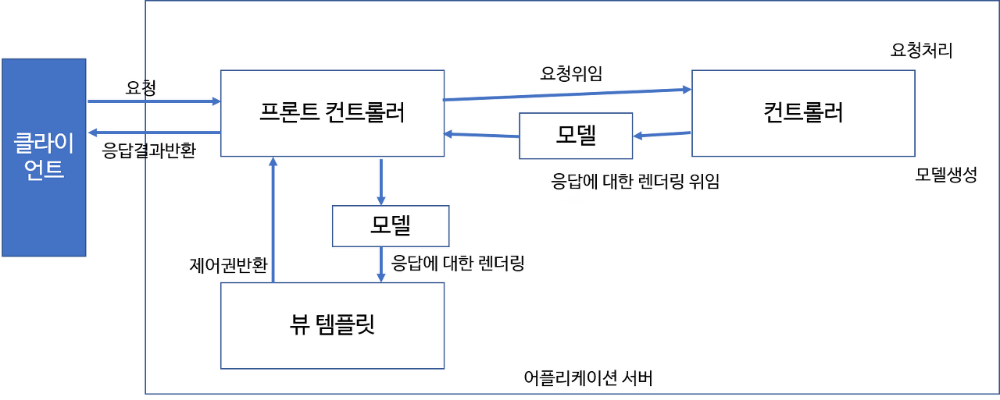
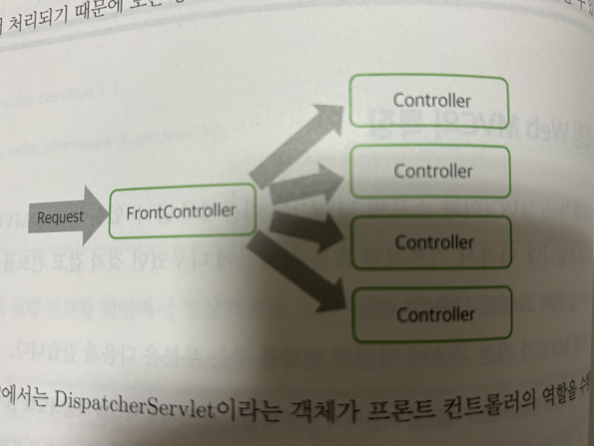

# 4.3 스프링 Web MVC 기초

스프링 프레임워크가 지금의 위치를 차지하는 데 가장 크게 기여한 부분은 '의존성 주입'이라고할 수 있지만 그 다음은
Web MVC의 영향이라고 생각한다.<br>
스프링의 Web MVC는 기본적으로 서블릿 API를 좀 더 추상화하여 작성한 라이브러리지만 기존의 서블릿/JSP를 사용할 때
필요한 많은 기능들을 기본적으로 제공해서 개발의 생산성과 안정성을 획기적으로 높여주었다.

## `스프링 Web MVC 특징`
- 스프링 Web MVC(이하 스프링 MVC)는 이름에서 알 수 있듯이 Web MVC 패턴으로 구현된 구조이다. 따라서 기본적인
흐름은 이전에 다루었던 것과 동일하며 컨트롤러, 뷰, 모델 등의 용어들 역시 그대로 사용한다.
- 스프링 MVC가 기존 구조에 약간의 변화를 주는 부분은 다음과 같다.
  1. `Front-Controller`패턴을 이용해 모든 흐름의 사전/사후 처리를 가능하도록 설계
  2. `어노테이션을 적극 활용`하여 최소한의 코드로 많은 처리가 가능하도록 설계
  3. HttpServletRequest/HttpServletResponse를 이용하지 않아도 될 만큼 추상화된 방식으로 개발 가능
- 스프링 MVC의 전체 흐름은 다음 그림과 같다.

  

### DispatcherServlet과 Front Controller
- 스프링 MVC에서 가장 중요한 사실은 모든 Request(요청)이 반드시 `DispatcherServlet`이라는 존재를 통해서
실행된다는 사실이다.

> 객체지향에서는 이렇게 모든 흐름이 하나의 객체를 통해 진행되는 패턴을 `facade(퍼사드) 패턴`이라고 하는데
> 웹 구조에서는 `Front-Controller 패턴`이라고 부르고 있다.

- Front-Controller 패턴을 이용하면 모든 요청이 반드시 하나의 객체(이하 프론트 컨트롤러)를 지나서 처리되기 때문에
모든 공통적인 처리를 프론트 컨트롤러에서 처리할 수 있게 된다.

  

- `스프링 MVC에서는 DispatcherServlet이라는 객체가 프론트 컨트롤러의 역할을 수행한다.`
- 프론트 컨트롤러가 사전/사후에 대한 처리를 하게 되면 중간에 매번 다른 처리를 하는 부분만 별도로 처리하는 구조를
만들게 된다. 스프링 MVC에서는 이를 Controller라고 하며 `@Controller`를 이용해 처리한다.


### 실습01 - 스프링 MVC 사용하기
- 앞에서 'spring-mvc' 라이브러리는 이미 추가하였으니 스프링 MVC 관련 설정만 추가하면 된다.
- 프로젝트 내 WEB-INF 폴더에 servlet-context.xml 파일을 생성한다. 기존의 root-context.xml
을 이용할 수도 있기는 하지만 일반적으로 `3 tier 구조를 분리하듯이` 다루는 영역이 웹이기 때문에 별도의
설정 파일을 이용하는 것이 일반적이다.

> servlet-context.xml이 생성되면 에디터 상단에 `Configure application context`가 뜨지만 이 설정은
> 조금 뒤쪽에서 모든 설정이 완료되면 자동으로 처리되므로 신경쓰지 않아도 된다.

- 프로젝트 내부에는 webapp 폴더 아래 'resources'라는 폴더를 생성하고 이 폴더에는 나중에 정적 파일들(html, css, js, 이미지 등)을
서비스하기 위한 경로이다.

#### servlet-context.xml의 설정
- 작성한 servlet-context.xml은 '\<mvc:..'라는 접두어로 설정에 활용해 다음과 같은 내용으로 작성한다.
```xml
<?xml version="1.0" encoding="UTF-8"?>
<beans xmlns="http://www.springframework.org/schema/beans"
       xmlns:xsi="http://www.w3.org/2001/XMLSchema-instance" xmlns:mvc="http://www.springframework.org/schema/mvc"
       xmlns:context="http://www.springframework.org/schema/context"
       xsi:schemaLocation="http://www.springframework.org/schema/beans http://www.springframework.org/schema/beans/spring-beans.xsd http://www.springframework.org/schema/mvc https://www.springframework.org/schema/mvc/spring-mvc.xsd http://www.springframework.org/schema/context https://www.springframework.org/schema/context/spring-context.xsd">

    <mvc:annotation-driven></mvc:annotation-driven>

    <mvc:resources mapping="/resources/**" location="/resources/"></mvc:resources>

    <bean class="org.springframework.web.servlet.view.InternalResourceViewResolver">
        <property name="prefix" value="/WEB-INF/views/"></property>
        <property name="suffix" value=".jsp"></property>
    </bean>


</beans>
```
- \<mvc:annotation-driven> 설정
  - 스프링 MVC 설정을 어노테이션 기반으로 처리한다는 의미
  - 여러 객체들을 자동으로 스프링의 Bean으로 등록하게 하는 기능
- \<mvc:resources> 설정
  - 이미지나 html 파일과 같이 정적인 파일의 경로를 지정
  - 예제에서 사용한 '/resources'경로로 들어오는 요청은 정적 파일을 요구하는 것이라고 생각하고 스프링 MVC에서 처리하지 않는다는 의미
  - location 속성 값은 webapp 폴더에 만들어둔 폴더를 의미한다. (굳이 저 경로를 이용하는 이유는 이클립스에서 생성하는 프로젝트와 구조를 동일하게 하기 위함)
- servlet-context.xml에는 InternalResourceViewResolver라는 이름의 클래스로 Bean이 설정되어 있다. 
  - 이 Bean은 스프링 MVC에서 제공하는 View를 어떻게 결정하는지에 대한 설정을 담당
  - prefix와 suffix의 내용을 보면 MVC에서 사용했던 WEB-INF 경로와 '.jsp'라는 확장자를 지정했는데, 이를 통해 예전에는 직접 '/WEB-INF/.jsp'와 같은
  설정을 생략할 수 있게 된다.


### web.xml의 DispatcherServlet 설정
- 스프링 MVC를 실행하려면 프론트 컨트롤러 역할을 하는 DispatcherServlet을 설정해야만 한다. 이 작업은 web.xml을 이용해 처리한다.

```xml
<?xml version="1.0" encoding="UTF-8"?>
<web-app xmlns="http://xmlns.jcp.org/xml/ns/javaee"
         xmlns:xsi="http://www.w3.org/2001/XMLSchema-instance"
         xsi:schemaLocation="http://xmlns.jcp.org/xml/ns/javaee http://xmlns.jcp.org/xml/ns/javaee/web-app_4_0.xsd"
         version="4.0">
    
    ...생략...
    
    <servlet>
        <servlet-name>appServlet</servlet-name>
        <servlet-class>org.springframework.web.servlet.DispatcherServlet</servlet-class>
        
        <init-param>
            <param-name>contextConfigLocation</param-name>
            <param-value>/WEB-INF/servlet-context.xml</param-value>
        </init-param>
        <load-on-startup>1</load-on-startup>
    </servlet>
    
    <servlet-mapping>
        <servlet-name>appServlet</servlet-name>
        <url-pattern>/</url-pattern>
    </servlet-mapping>
</web-app>
```
- \<servlet> 설정 : DispatcherServlet을 등록하는데 DispatcherServlet이 로딩할 때 servlet-context.xml을 이용하도록 설정
- \<load-on-startup> 설정 : 톰캣 로딩 시에 클래스를 미리 로딩해 두기 위한 설정
- \<servlet-mapping> 설정 : DispatcherServlet이 모든 경로의 요청(Request)에 대한 처리를 담당하기 때문에 '/'로 지정

> 스프링과 스프링 MVC의 모든 설정은 이게 전부다. 처음 시도해보면 조금 복잡할 수 있지만 공통적인 설정은 그대로 복사해서 사용하기 때문에 익숙해지는 것이 중요하다. <br>
> 프로젝트를 실행해서 발생하는 로그에 스프링 관련 로그들이 출력되는지 확인하는 것이 중요하다. 프로젝트가 정상적으로 실행된다면 마지막 부근에 DispatcherServlet이 초기화
> 되었다는 메시지가 출력된다.

```
08:28:20  INFO [org.springframework.web.servlet.DispatcherServlet] Initializing Servlet 'appServlet'
08:28:20  INFO [org.springframework.web.servlet.DispatcherServlet] Completed initialization in 193 ms
```


### 실습02 - 스프링 MVC 컨트롤러
- 스프링 MVC 컨트롤러는 전통적인 자바의 클래스 구현 방식과 상당히 다르다. 과거의 많은 Framework들은 상속이나 인터페이스를 기반으로
구현되는 방식을 선호했다면 스프링 MVC의 컨트롤러들은 다음과 같은 점이 다르다.
  1. 상속이나 인터페이스를 구현하는 방식이 아닌 `어노테이션만으로 처리가 가능`
  2. 오버라이드 없이 필요한 메소드들을 정의
  3. 메소드의 파라미터의 타입을 기본 자료형이나 객체 자료형으로 마음대로 지정 가능
  4. 메소드의 리턴타입도 void, String, 객체 등 다양한 타입 사용 가능
- 스프링 MVC 컨트롤러는 웹 개발에서 필수이므로 다양한 예제를 실습할 필요가 있다. 예제로 작성하는 컨트롤러들은 프로젝트 내 controller라는 패키지를
추가하여 이곳에 클래스 파일들을 작성하도록 한다.
- 먼저 SampleController 클래스를 추가하겠다.
  ```java
  @Controller
  @Log4j2
  public class SampleController {
    
    @GetMapping("/hello")
    public void hello(){
      log.info("hello.........");
    }
    
  }
  ```
  - @Controller는 해당 클래스가 스프링 MVC에서 컨트롤러 역할을 한다는 것을 의미하며 스프링의 Bean으로 처리되기 위해 사용한다.
  - @GetMapping은 조금 뒤에 자세히 설명하겠지만 GET 방식으로 들어오는 요청(Request)을 처리하기 위해 사용한다. 위의 코드의 경우 '/hello'라는 경로
  를 호출할 때 동작하게 된다.


### servlet-context.xml의 component-scan
- controller 패키지에 존재하는 컨트롤러 클래스들을 스프링으로 인식하기 위해서는 `해당 패키지를 스캔하여` @Controller
어노테이션이 추가된 클래스들의 객체들을 스프링의 Bean으로 설정되게 만들어야 한다.
- servlet-context.xml에 component-scan을 다음과 같이 적용한다.
  ```xml
  <?xml version="1.0" encoding="UTF-8"?>
  <beans xmlns="http://www.springframework.org/schema/beans"
         xmlns:xsi="http://www.w3.org/2001/XMLSchema-instance" xmlns:mvc="http://www.springframework.org/schema/mvc"
         xmlns:context="http://www.springframework.org/schema/context"
         xsi:schemaLocation="http://www.springframework.org/schema/beans http://www.springframework.org/schema/beans/spring-beans.xsd http://www.springframework.org/schema/mvc https://www.springframework.org/schema/mvc/spring-mvc.xsd http://www.springframework.org/schema/context https://www.springframework.org/schema/context/spring-context.xsd">
  
      ...생략...
  
      <context:component-scan base-package="org.zerock.springex.controller"/>
  
  
  </beans>
  ```
- 프로젝트를 실행해 브라우저 상에 '/hello' 경로를 호출하면 log만 출력되고 404 error가 발생한다. 이는 아직 '/WEB-INF/views/hello.jsp'
파일이 존재하지 않기 때문이여서 생성해준다.
  ```html
  <%@ page contentType="text/html;charset=UTF-8" language="java" %>
  <html>
  <head>
    <title>Title</title>
  </head>
  <body>
    <h1>Hello JSP</h1>
  </body>
  </html>
  ```

> 프로젝트를 다시 실행하거나 로딩하면 Hello JSP가 정상적으로 출력되는 것을 볼 수 있다.


### @RequestMapping의 파생 어노테이션들
- 스프링 컨트롤러에서 가장 많이 사용하는 어노테이션은 `@RequestMapping`이다. @RequestMapping은 말 그대로 
'특정한 경로의 요청(request)을 지정'하기 위해 사용한다.
- @RequestMapping은 컨트롤러 클래스의 선언부와 컨트롤러의 메소드에서 둘 다 사용 가능하다.

> 서블릿 중심의 MVC의 경우 Servlet을 상속받아 doGet()/doPost()와 같은 제한적인 메소드를 오버라이드 해서
> 사용했지만 스프링 MVC의 경우 하나의 컨트롤러를 이용해서 여러 경로의 호출을 모두 처리할 수 있다.

- 예를 들어 '/todo/list'와 '/todo/register'를 어떻게 하나의 컨트롤러에 작성할 수 있는지 보자. controller 패키지에
TodoController 클래스를 추가한다.
  ```java
  @Controller
  @RequestMapping("/todo")
  @Log4j2
  public class TodoController {
    @RequestMapping("/list")
    public void list(){
      log.info("todo list........");
    }
  
    @RequestMapping(value = "/register", method = RequestMethod.GET)
    public void register(){
      log.info("todo register...........");
    }
  }
  ```
  - TodoController의 @RequestMaaping의 value 값은 '/todo'이고 list()는 '/list'이므로 최종 경로는
  '/todo/list'가 된다.
  - JSP 파일이 없기 때문에 브라우저에서는 에러가 발생하지만 '/todo/list'를 실행하면 로그가 출력되어야 한다.

> @RequestMapping을 이용하는 것만으로도 여러 개의 컨트롤러를 하나의 클래스로 묶을 수 있고 각 기능을 메소드 단위로
> 설계할 수 있게되므로 실제 개발에서 많은 양의 코드를 줄일 수 있다.

- RequestMapping에는 method라는 속성을 이용해 GET/POST 방식을 구분했지만 스프링 4버전 이후에는 @GetMapping, @PostMapping
어노테이션으로 처리 가능하다. 예를 들어 Todo 등록의 경우 GET 방식으로 '/todo/register'를 이용하면 입력 가능한 화면을
보여주고, POST 방식은 처리를 해야 한다. 코드를 작성해보면 다음과 같다.

  ```java
  //  @RequestMapping(value = "/register", method = RequestMethod.GET)
    @GetMapping("/register")
    public void register(){
      log.info("todo register...........");
    }
    
    @PostMapping("/register")
    public void registerPost(){
      log.info("POST todo register......");
    }
  ```


## `파라미터 자동 수집과 변환`
- 스프링 MVC가 인기를 끌게 된 여러 이유 중 하나는 개발 시간을 단축할 수 있는 기능들이 많기 때문이다. 그 중 개발자들에게
가장 필요한 `파라미터 자동 수집`에 대하여 알아볼 것이다.
- 파라미터 자동 수집은 간단히 말해 `DTO나 VO 등을 메소드의 파라미터로 설정하면 자동으로 전달되는 HttpServletRequest의
파라미터들을 수집`해 주는 기능이다.
- 단순히 문자열만이 아니라 숫자도 가능하고, 배열이나 리스트, 첨부 파일도 가능하며 파라미터 수집은 다음과 같은 기준으로 동작한다.
  1. 기본 자료형의 경우 자동으로 형 변환처리가 가능
  2. 객체 자료형의 경우 setXXX()의 동작을 통해 처리됨
  3. 객체 자료형의 경우 생성자가 없거나 파라미터가 없는 생성자가 필요(Java Beans)


### 실습03 - 단순 파라미터의 자동 수집
- SampleController에 다음과 같이 ex1()을 추가해보자
  ```java
  @GetMapping("/ex1")
    public void ex1(String name, int age){
      log.info("ex1..........");
      log.info("name: " + name);
      log.info("age: " + age);
    }
  ```
  - 브라우저로 '/ex1?name=AAA&age=16'과 같이 호출되었을 때 자동으로 처리 된다. 단 JSP가 없으므로 브라우저에는
  404 에러가 발생한다.

#### @RequestParam
- 스프링 MVC의 파라미터는 기본적으로 Request에 전달된 파라미터 이름을 기준으로 동작하지만 간혹 파라미터가 전달되지 않으면
문제가 발생할 수 있다. 이런 경우 @RequestParam이라는 어노테이션을 사용해 `기본값`을 지정할 수 있다.
```java
@GetMapping("/ex2")
  public void ex2(@RequestParam(name = "name", defaultValue = "AAA") String name,
                  @RequestParam(name = "age", defaultValue = "20") int age){
    log.info("ex2..........");
    log.info("name: " + name);
    log.info("age: " + age);
  }
```

#### Formatter를 이용한 파라미터의 커스텀 처리
- 기본적으로 HTTP는 문자열로 데이터를 전달하기 때문에 컨트롤러에서는 문자열을 기준으로 특정한 클래스의 객체로 처리하는 작업이
진행된다.
- 이때 개발에서 가장 문제가 되는 타입이 바로 날짜 관련 타입인데 브라우저에서 보낸 '2020-10-10'과 같은 형태의 문자열을 컨트롤러에서
Date, LocalDate, LocalDateTime 등으로 변환하는 작업은 많이 필요하지만 이에 대한 파라미터 수집은 에러가 발생한다.
  ```java
  @GetMapping("/ex3")
    public void ex3(LocalDate dueDate){
      log.info("ex3..........");
      log.info("dueDate: " + dueDate);
    }
  ```
  - 따라서 위의 코드와 같은 경우 '/ex3'을 호출하면 에러가 발생하며, 에러를 살펴보면 String타입을 java.time.LocalDate로
  변환할 수 없어 생긴 에러라는 것을 알 수 있다.
- 이런 경우, 특정한 타입을 처리하는 Formatter라는 것을 이용할 수 있다. `Formatter는 말 그대로 문자열 포맷을 이용해
특정한 객체로 변환하는 경우에 사용한다.`
- controller 패키지에 formatter 패키지를 작성하고 LocalDateFormatter 클래스를 작성한다. Formatter 인터페이스에는
parse()와 print() 메소드가 존재한다.
  ```java
  public class LocalDateFormatter implements Formatter<LocalDate> {
    @Override
    public LocalDate parse(String text, Locale locale) throws ParseException {
      return LocalDate.parse(text, DateTimeFormatter.ofPattern("yyyy-MM-dd"));
    }
  
    @Override
    public String print(LocalDate object, Locale locale) {
      return DateTimeFormatter.ofPattern("yyyy-MM-dd").format(object);
    }
  }
  ```
- Formatter를 servlet-context.xml에 적용하기 위해서는 조금 복잡한 과정이 필요하다.
- FormattingConversionServiceFactoryBean 객체를 스프링의 Bean으로 등록해야 하고 이 안에 작성한 LocalDateFormatter를
추가해야만 한다.
- servlet-context.xml에 다음과 같은 코드를 추가한다.
  ```xml
  <bean id="conversionService" class="org.springframework.format.support.FormattingConversionServiceFactoryBean">
          <property name="formatters">
              <set>
                  <bean class="org.zerock.springex.controller.formatter.LocalDateFormatter"/>
              </set>
          </property>
      </bean>
  
      <mvc:annotation-driven conversion-service="conversionService"/>
  ```
  - conversionService라는 Bean을 등록한 후, 스프링 MVC를 처리할 때 \<mvc:annotation-driven>에 이를 이용
  한다는 것을 지정해야만 한다.

> 앞선 설정이 모두 반영되고 프로젝트를 재시작하면 브라우저를 이용해 '/ex3?dueDate=2020-10-10'와 같은 호출을 했을 때
> 정상적으로 동작하는 것을 확인할 수 있다.

<br>

### 객체 자료형의 파라미터 수집 
- 기본 자료형과 달리 객체 자료형을 파라미터로 처리하기 위해서는 객체가 생성되고 setXXX()을 이용해 처리하며 Lombok을 활용해 @Setter나 @Data를 이용하는 것이
가장 간단한 방법이다.
- 프로젝트에 dto 패키지를 추가하고 TodoDTO클래스를 추가한다. 이전 예제에서 사용했던 TodoDTO에 작성자를 의미하는 writer를 추가해서 작성한다.
  ```java
  @ToString
  @Data
  @Builder
  @AllArgsConstructor
  @NoArgsConstructor
  public class TodoDTO {
    private Long tno;
    private String title;
    private LocalDate dueDate;
    private boolean finished;
    private String writer; //새로 추가
  }
  ```

> Lombok의 @Data 어노테이션의 경우 객체의 Getter, Setter, toString, equals, hashCode를 자동으로 생성해준다.


- TodoController의 'todo/register'를 POST 방식으로 처리하는 메소드에 TodoDTO를 파라미터로 적용해 본다.
  ```java
  @PostMapping("/register")
    public void registerPost(TodoDTO todoDTO){
      log.info("POST todo register......");
      log.info(todoDTO);
    }
  ```
  - 수정된 registerPost()의 파라미터는 TodoDTO를 사용하도록 수정되었다. 
  - 자동으로 형 변환이 처리되므로 TodoDTO와 같이 다양한 타입의 멤버 변수들의 처리가 자동으로 이루어진다.

<br>

- WEB-INF/views에는 todo 폴더를 생성하고 register.jsp를 추가한다.
  ```html
  <%@ page contentType="text/html;charset=UTF-8" language="java" %>
  <%@ taglib prefix="c" uri="http://java.sun.com/jsp/jstl/core" %>
  
  <!doctype html>
  <html lang="ko">
  <head>
    <title>Title</title>
  </head>
  <body>
    <form action="/todo/register" method="post">
      <div>
        Title: <input type="text" name="title">
      </div>
      <div>
        Title: <input type="date" name="dueDate" value="2024-05-28">
      </div>
      <div>
        Writer: <input type="text" name="writer">
      </div>
      <div>
        Finished: <input type="checkbox" name="finished">
      </div>
      <div>
        <button type="submit">Register</button>
      </div>
    </form>
  </body>
  </html>
  ```
  - GET 방식으로 '/todo/register'를 호출하면 이 jsp파일을 볼 수 있다.
  - form을 POST 방식으로 submit했을 때 TodoDTO의 로그가 정상적으로 출력되는 것을 볼 수 있다.


### Model이라는 특별한 파라미터
- 스프링 MVC는 기본적으로 웹 MVC와 동일한 방식이고 `Model`이라고 부르는 데이터를 JSP까지 전달한다.
- 순수한 서블릿 방식에서는 request.setAttribute()를 이용해 데이터를 담아 JSP까지 전달했지만 스프링 MVC 방식에서는 Model이라는 객체를
이용해 처리할 수 있다.

> 초기 스프링 MVC에서는 ModelAndView라는 객체를 생성하는 방식으로 사용했지만, 스프링 MVC 3 버전 이후부터는 Model(org.springframework.ui.Model)이라는
> 파라미터만 추가하면 된다.

- Model에는 addAttribute()라는 메소드를 이용해 View에 전달할 '이름'과 '값(객체)'을 지정할 수 있다.
- SampleController를 통해 이를 확인해보자
  ```java
  @GetMapping("/ex4")
    public void ex4(Model model){
      log.info("-----------------------");
      model.addAttribute("message", "Hello World!!");
    }
  ```
- /WEB-INF/views 폴더에는 ex4.jsp를 다음과 같이 구성한다.
  ```html
  <%@ page contentType="text/html;charset=UTF-8" language="java" %>
  <%@ taglib uri="http://java.sun.com/jsp/jstl/core" prefix="c" %>
  <html>
  <head>
    <title>Title</title>
  </head>
  <body>
    <h1>${message}</h1>
    <h1><c:out value="${message}"></c:out></h1>
  </body>
  </html>
  ```
  - Model에 담긴 데이터는 내부적으로 HttpServletRequest의 setAttribute()와 동일한 동작을 수행하므로 JSP에서는 EL을 이용해 바로 사용 가능하다.

#### Java Beans와 @ModelAttribute
- 스프링 MVC의 컨트롤러는 getter/setter를 이용하는 Java Beans의 사용자 정의 클래스가 파라미터인 경우에는 자동으로 View까지 객체를 전달한다.
- 예를 들어 파라미터로 TodoDTO를 받는 경우를 작성해보자.
  ```java
  @GetMapping("/ex4_1")
    public void ex4Extra(TodoDTO todoDTO, Model model){
      log.info(todoDTO);
    }
  ```
  - 이런 경우 JSP에서는 별도의 처리 없이 ${todoDTO}를 이용할 수 있게 된다.
  - ${}의 변수명은 타입의 앞글자만 소문자로 변경되어 처리된다. 

- 만일 자동으로 생성된 변수명 todoDTO라는 이름 외에 다른 이름을 사용하고 싶다면 명시적으로 `@ModelAttribute()`를 지정할 수 있으며 다음과 같이 작성한다.
  ```java
  @GetMapping("/ex4_1")
    public void ex4Extra(@ModelAttribute("dto") TodoDTO todoDTO, Model model){
      log.info(todoDTO);
    }
  ```
  - 이 경우 JSP에서는 ${dto}와 같은 이름의 변수로 처리할 수 있게된다.


### RedirectAttributes와 리다이렉션
- POST 방식으로 어떤 처리를 하고 Redirect를 해서 GET 방식으로 특정한 페이지로 이동하는 `PRG 패턴`을 처리하기 위해
스프링 MVC에서는 `RedirectAttributes`라는 특별한 타입을 제공한다.
- RedirectAttributes 역시 Model과 마찬가지로 파라미터로 추가해 주기만 하면 자동으로 생성되는 방식으로 개발할 때 사용할
수 있다.
- RedirectAttributes에서 중요한 메소드는 다음과 같다.
  - addAttribute(key, value) : 리다이렉트할 때 쿼리 스트링이 되는 값을 지정
  - addFlashAttribute(key, value) : 일회용으로만 데이터를 전달하고 삭제되는 값을 지정
- SampleController에 다음 코드를 추가하자
  ```java
  @GetMapping("/ex5")
    public String ex5(RedirectAttributes redirectAttributes){
      redirectAttributes.addAttribute("name", "ABC");
      redirectAttributes.addFlashAttribute("result", "success");
  
      return "redirect:/ex6";
    }
  
    @GetMapping("/ex6")
    public void ex6s(){
  
    }
  ```
  - ex5()는 RedirectAttributes를 파라미터로 추가하고, addAttribute()와 addFlashAttribute()를 이용해
  name과 result라는 이름의 데이터를 전달한다.
  - 스프링 MVC에서 'redirect:'라는 접두어를 붙여 문자열을 반환하도록 하여 리다이렉트 할 수 있다.
  - 브라우저에서 '/ex5'를 호출하면 서버에서는 다시 '/ex6' 경로를 호출하라고 알려준다.


<br>

- WEB-INF/views에서는 '/ex5'에 해당하는 JSP는 필요 없으므로 ex6.jsp만 다음과 같이 작성한다.
  ```html
  <%--
    Created by IntelliJ IDEA.
    User: ds
    Date: 5/28/24
    Time: 12:13 PM
    To change this template use File | Settings | File Templates.
  --%>
  <%@ page contentType="text/html;charset=UTF-8" language="java" %>
  <html>
  <head>
    <title>Title</title>
  </head>
  <body>
    <h1>ADD FLASH ATTRIBUTE: ${result}</h1>
  </body>
  </html>
  ```

> 'ex5'를 호출했을 때 '/ex6?name=ABC'로 리다이렉트 되며 addFlashAttribute()로 추가한 result는 눈에 보이지는
> 않지만 JSP에서는 일회용으로 사용 가능하다. 새로고침을 하면 result 변수가 더 이상 존재하지 않는 것을 확인할 수 있다.


### 다양한 리턴 타입


### 스프링 MVC에서 주로 사용하는 어노테이션들


## `스프링 MVC의 예외 처리`

