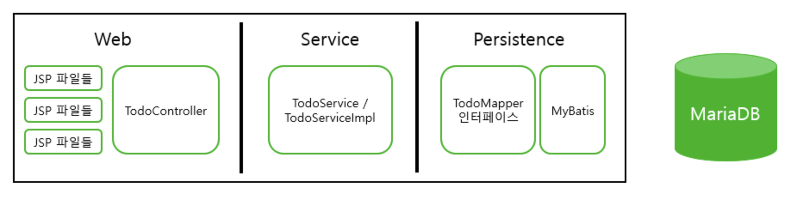
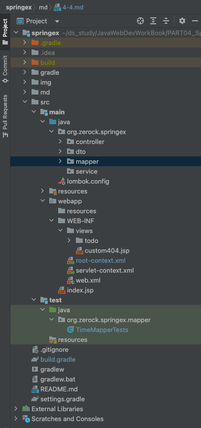

# 4.4 스프링 Web MVC 구현하기

스프링 프레임워크와 스프링 MVC를 결합해 이전에 웹 MVC로 개발했던 Todo 예제를 개발해보자. 어떤 식으로 개발해야 하는지
전체적인 구조를 살펴보고 적용할 예정이다.<br>
이 절에서 작성하려는 예제는 스프링과 MyBatis, 스프링 MVC를 모두 결합하는 구조다. 기존과 동일하게 CRUD 기능을 개발하고
추가로 페이징 처리와 검색 기능을 구현해 볼 것이다.


## 프로젝트의 구현 목표와 준비
- Todo 프로젝트의 기능적 요구사항
  1. 검색과 필터링을 적용할 수 있는 화면을 구성하고 MyBatis의 동적 쿼리를 이용해 상황에 맞는 Todo들을 검색 가능
  2. 새로운 Todo를 등록할 때 String, boolean, LocalDate를 자동으로 처리
  3. 목록에서 조회 화면으로 이동할 때 모든 검색, 필터링, 페이징 조건을 유지하도록 구성
  4. 조회 화면에서는 모든 조건을 유지한 채로 수정/삭제 화면으로 이동하도록 구성
  5. 삭제 시에는 다시 목록 화면으로 이동
  6. 수정 시에는 다시 조회 화면으로 이동하지만, 검색, 필터링, 페이징 조건은 초기화

- 프로젝트는 3-Tier Architecture로 구성되며 다음과 같다. 
  
  
  
  1. Web (Presentation Layer)
     - 역할 : UI를 제공하고 사용자 입력을 처리.
     - 구성 요소 : 
       - JSP 파일들 : 웹 페이지를 구성하는 JSP 파일들로, 사용자에게 정보를 표시하고 입력을 받는다.
       - TodoController : Spring MVC 컨트롤러로서, 사용자의 요청을 받아 Service Layer로 전달하고 응답을
       사용자에게 반환한다.
  2. Service (Application Logic Layer)
     - 역할 : 비즈니스 로직을 처리하고, 데이터의 흐름을 제어한다. Presentation Layer와 Persistence Layer사이의 
     중개 역할을 한다.
     - 구성 요소 :
       - TodoService 인터페이스 : Application의 주요 비즈니스 로직을 정의한다.
       - TodoServiceImpl : TodoService 인터페이스를 구현하여 실제 비즈니스 로직을 처리
  3. Persistence (Data Access Layer)
     - 역할 : DB와의 상호작용을 관리. 데이터를 저장하고 검색하는 역할
     - 구성 요소 :
       - TodoMapper 인터페이스 : MyBatis를 사용하여 데이터베이스 쿼리를 매핑. SQL 쿼리와 자바 객체를 연결하는 역할
       - MyBatis : Persistence Layer에서 데이터 접근 로직을 자동으로 생성하고 실행


### 프로젝트의 준비
- 프로젝트의 기본 설정은 이전 장에서 사용했던 설정들을 그대로 이용하지만 몇 개의 새로운 라이브러리가 필요하다. 먼저 build.gradle에
다음과 같은 라이브러리들이 있는지 확인한다.
  ```groovy
    //Spring
    implementation group: 'org.springframework', name: 'spring-core', version: '5.3.19'
    implementation group: 'org.springframework', name: 'spring-context', version: '5.3.19'
    implementation group: 'org.springframework', name: 'spring-test', version: '5.3.19'
    implementation group: 'org.springframework', name: 'spring-webmvc', version: '5.3.19'
    implementation group: 'org.springframework', name: 'spring-jdbc', version: '5.3.19'
    implementation group: 'org.springframework', name: 'spring-tx', version: '5.3.19'
  
    //MariaDB
    implementation 'org.mariadb.jdbc:mariadb-java-client:3.0.4'
    //HikariCP
    implementation group: 'com.zaxxer', name: 'HikariCP', version: '5.0.1'
    //MyBatis
    implementation 'org.mybatis:mybatis:3.5.9'
    implementation 'org.mybatis:mybatis-spring:2.0.7'
  
    //JSTL
    implementation group: 'jstl', name: 'jstl', version: '1.2'
  ```
- 다음은 새롭게 필요한 라이브러리다.
  ```groovy
    //DTO와 VO의 변환을 위한 ModelMapper
    implementation group: 'org.modelmapper', name: 'modelmapper', version: '3.0.0'
  
    //DTO의 검증을 위한 Validate관련 라이브러리
    implementation group: 'org.hibernate', name: 'hibernate-validator', version: '6.2.1.Final'
  ```


### 프로젝트의 폴더/패키지 구조
- 먼저 이전에 구현했던 sample과 관련된 것들을 모두 정리한 상태에서 개발을 시작해보자
  1. sample 패키지와 HelloServlet을 삭제
  2. webapp 폴더의 SampleController가 사용했던 JSP 모두 삭제
  3. test 폴더에서도 sample와 관련된 모든 기능 삭제
  4. root-context.xml에서도 sample 패키지를 사용하는 부분은 삭제 
  (context:component-scan의 "org.zerock.springex.sample"부분 태그를 삭제하면 된다.)
- 프로젝트 내에 service를 위한 패키지를 추가해준다. 그러면 전체적인 패키지와 디렉토리 구조는 다음과 같다.
  
- 테이블을 수정해보자. 기존에 연결했던 webdb에 연결 후 다음과 같은 쿼리를 날린다.
  ```sql
  drop table tbl_todo;
  
  create table tbl_todo(
      tno int auto_increment primary key ,
      title varchar(100) not null,
      dueDate date not null ,
      writer varchar(50) not null ,
      finished tinyint default 0
  );
  ```
  - 기존 테이블과 달리 프로젝트에서 사용하는 tbl_todo은 기존 테이블에 writer라는 column을 추가해
  작성하기 때문에 기존의 테이블을 drop한다.


### ModelMapper 설정과 @Configuration


